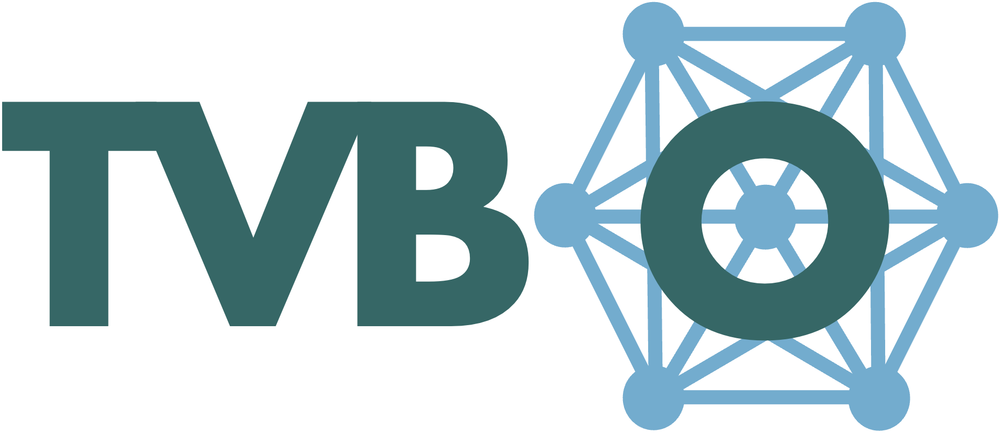

<a href="imgs/tvbo_logo.png">
    
</a>


The Virtual Brain Ontology
==========================
[](https://github.com/the-virtual-brain/tvb-o/actions?query=workflow%3A%22Python+package%22)
[](https://pypi.org/project/tvbo/)
[](https://pypi.org/project/tvbo/)

## Installation
```tvbo``` will be available on pypi after our manuscript has been published. To install the latest released version, simply run `pip install tvbo`.
> **Warning**: Until Publication, TVBase will be not installable via pypi. Therefore please refer to the developer installation for now.

### Optional API dependencies
To install only the additional packages needed for the FastAPI-based API, use the `api` extra:

```bash
pip install "tvbo[api]"
```

This keeps the base install slim and adds only FastAPI and an ASGI server (uvicorn) for running the API app in `tvbo/api/main.py`.

### Optional TVB dependencies
If you want full integration with TVB (tvb-library, tvb-framework), install the `tvb` extra:

```bash
pip install "tvbo[tvb]"
```

This moves the heavy TVB packages out of the base install and lets you opt-in when you need TVB functionality.

### Optional Knowledge dependencies
If you want to include the neurommsig knowledge base integration, install the `knowledge` extra:

```bash
pip install "tvbo[knowledge]"
```

### Install everything
To install all optional features (API + TVB + Knowledge):

```bash
pip install "tvbo[all]"
```

## Container Build

```bash
docker build --secret id=gitlab_token,env=GITLAB_TOKEN -t tvbo .
```

Push the container to the registry:
```bash
docker buildx build --platform linux/amd64 --secret id=gitlab_token,env=GITLAB_TOKEN -t registry.bihealth.org:443/bss/tvb-o/tvbo-container/tvbo:latest --push .
```

### Developer installation
To install an editable version of ```tvbo``` run the following in a terminal:
```bash
git clone https://github.com/the-virtual-brain/tvb-o.git
cd tvb-o
pip install -r ./requirements.txt
pip install -e .
```

The code was tested and validated with python version 3.9, but it might work with newer versions as well.

## Getting started
### What's inside TVB-O?
For a first overview of TVB-O, please refer to our [example notebooks](./notebooks).

## Documentation
For a more detailed description of TVB-O, please refer to our [documentation](./docs/index.md).
For a local build of the documentation, please run the following in a terminal:

```bash
cd tvbo-python
make docs
```

## More Info
Brain simulation plays an increasing role  in the development of new diagnostic and therapeutic solutions. Theoretical concepts built into simulation technologies, such as The Virtual Brain (TVB), allow for the computation of patient-specific brain models, serving as in silico platforms for clinical hypothesis testing, by manipulating model parameters. However, the broad spectrum of computational models currently available and the significant number of parameters governing their dynamics and structure, makes it difficult, or even impossible, to systematically compare  simulated results to identify generalizable neurobiological principles - a precondition for  successful translation into clinical tools. One potential solution is offered by highly structured, computational knowledge representation, as available in knowledge bases and ontologies. Therefore, we developed The Virtual Brain Ontology (TVB-O): the first Web Ontology Language (OWL2) ontology that formalizes the mathematical framework at the core of TVB, providing a valuable resource for annotation of large-scale brain network model (BNM) components. TVB-O goes beyond the annotation of terms, entities, and relationships,  by relating TVB defined mathematical models to multiscale, multimodal biological information. This was achieved by linking each biophysically defined BNMs' component to its potential neurobiological surrogates from the automated and manual curation of a biological knowledge ontology, Gene Ontology (GO).  This mapping empowers the systematic and automated integration of literature-derived biological knowledge into BNM and allows for the development of cause-and-effect models. Additionally, for interoperability with TVB, we implemented full compatibility with RateML, an automatic code generator of models for defining BNMs succinctly that is already part of TVB main repository. TVB-O provides a powerful new computational add-on tool for the general neuroscientific community, including clinicians,  that paves the way for a better understanding of the underlying mechanisms involved in brain function and dysfunction, with the exciting potential to guide future intervention and drug discovery strategies through the simulation of biologically informed personalized BNMs.
