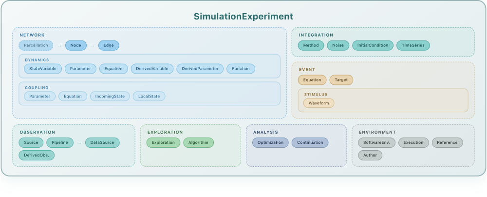
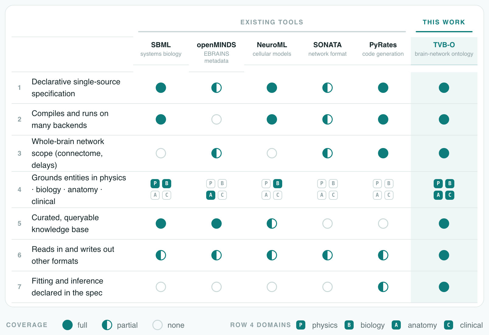

# The Virtual Brain Ontology

[](https://github.com/virtual-twin/tvbo/actions/workflows/ci.yml)
[](https://github.com/astral-sh/ruff)
[](https://pypi.org/project/tvbo/)
[](https://pypi.org/project/tvbo/)
[](LICENSE)
[](https://tvbo.charite.de)

`tvbo` is a semantic knowledge base, a metadata standard, and a Python toolbox for whole-brain network simulations. You describe a whole experiment (equations, network, coupling, integration, stimuli, observation, provenance) as one typed, ontology-grounded specification. From that single source, `tvbo` does two things:

- **Compiles** it to runnable code across many backends and to a methods report, so a published study re-runs without drift between what the paper says, what the code does, and what the docs claim.
- **Grounds** every entity in a four-domain ontology and knowledge graph, so models can be compared by what their parameters *mean*, not by what they are *called*.

<p align="center">
  
</p>

The hosted platform at [tvbo.charite.de](https://tvbo.charite.de) gives the same knowledge base and an experiment builder in the browser, with no local install.

## Installation

```bash
pip install tvbo
```

Requires Python 3.11 or newer. The core install compiles any specification and runs it on JAX. Other simulation backends install as extras, listed in the [Backends](#backends) table.

## Quick start

### Specify a model and run it

```python
from tvbo import Dynamics, SimulationExperiment

lorenz = Dynamics(
    parameters={"sigma": {"value": 10.0}, "rho": {"value": 28.0}, "beta": {"value": 8 / 3}},
    state_variables={
        "X": {"equation": {"rhs": "sigma * (Y - X)"}},
        "Y": {"equation": {"rhs": "X * (rho - Z) - Y"}},
        "Z": {"equation": {"rhs": "X * Y - beta * Z"}},
    },
)

# compile to JAX (core install) and run
SimulationExperiment(dynamics=lorenz).run("jax", duration=1000).plot()
```

<details>
<summary>The same model as a YAML specification</summary>

```yaml
name: LorenzAttractor
parameters:
  sigma: {value: 10, label: Prandtl number}
  rho:   {value: 28, label: Rayleigh number}
  beta:  {value: 2.6666666666666665}
state_variables:
  X: {equation: {lhs: \dot{X}, rhs: sigma * (Y - X)}}
  Y: {equation: {lhs: \dot{Y}, rhs: X * (rho - Z) - Y}}
  Z: {equation: {lhs: \dot{Z}, rhs: X * Y - beta * Z}}
```

Load it with `Dynamics.from_file("lorenz.yaml")`.
</details>

### Inspect the generated code without running it

```python
exp = SimulationExperiment(dynamics=lorenz)
print(exp.render_code("jax"))     # or "numpy", "julia", "tvb", "pyrates", ...
```

### Load a curated model from the library

Models, networks, and studies ship with the package:

```python
from tvbo import Dynamics, SimulationExperiment

exp = SimulationExperiment(dynamics=Dynamics.from_db("JansenRit"))
exp.run("jax").plot()
exp.report("pdf", outputfile="methods.pdf")   # provenance-aware methods report
```

Assemble a network model from curated components, referenced by semantic `iri` pointers:

```python
exp = SimulationExperiment(
    dynamics={"iri": "tvbo:ReducedWongWangExcInh"},
    coupling={"iri": "tvbo:Linear"},
    network={
        "parcellation": {"atlas": {"iri": "tvbo:DesikanKilliany"}},
        "tractogram": {"iri": "tvbo:dTOR"},
    },
    integration={"method": "Heun", "duration": 10_000},
)
```

## Anatomy of a SimulationExperiment

A specification captures everything needed to reproduce a run, not just the equations. Each section is written inline, loaded from YAML, or referenced by an `iri` pointer into the knowledge base.

<p align="center">
  
</p>

## What you can do

| | |
|---|---|
| **Specify** | Write dynamics, networks, coupling, stimuli, and observation as symbolic, typed objects in Python or YAML. Equations are stored symbolically, independent of any language or simulator. |
| **Compile and run** | Generate synchronized code for 14 backends from one spec, then execute it (see the table below). |
| **Explore and fit** | Declare parameter sweeps. The JAX-based `tvboptim` backend turns any experiment into a differentiable simulator for gradient-based fitting, Bayesian calibration, and large sweeps. |
| **Analyze** | Run bifurcation analysis and numerical continuation of model regimes. |
| **Ground** | Link every entity to a four-domain ontology: physics (QUDT/UO units), biology (Gene Ontology, ChEBI), anatomy (UBERON, openMINDS/SANDS), clinical (MeSH, ICD). Query the resulting knowledge graph. |
| **Report and share** | Export FAIR metadata (LinkML YAML, openMINDS JSON-LD), W3C PROV-O provenance graphs, and methods reports (Markdown/PDF) from the same spec. |
| **Scale out** | Emit self-contained SLURM, Snakemake, or Nextflow kits from the CLI (`tvbo workflow submit`) to run large sweeps on a cluster. |
| **Assist agents** | `tvbo skills install` gives AI coding assistants (Claude, Cursor, Copilot) the spec format and a knowledge graph to query instead of guessing. |

## Backends

One specification, many targets. `render_code(format=...)` exports; `run(format=...)` executes.

| Backend | Extra | For |
|---|---|---|
| JAX | core | Fast, differentiable, GPU/TPU; runs out of the box |
| `tvboptim` (default for `run()`) | `tvbo[tvboptim]` | JAX-based fitting, Bayesian calibration, large sweeps |
| NumPy / Python | core | Readable reference implementations |
| TVB | `tvbo[tvb]` | The Virtual Brain's curated neural-mass library |
| PyRates | `tvbo[pyrates]` | Rate-coded network models and numerical continuation |
| Julia (DifferentialEquations.jl, ModelingToolkit.jl, NetworkDynamics.jl, BifurcationKit.jl) | `tvbo[julia]` | Stiff solvers, symbolic modelling, bifurcation |
| NeuroML / LEMS | `tvbo[neuroml]` | Run via jNeuroML, NEURON, Brian2, NetPyNE, EDEN |

Install a backend with `pip install tvbo[<extra>]`. The compiler also emits surface PDE-FEM fields and RateML/CUDA GPU kernels.

Backends are designed to agree within each integrator's numerical tolerance, not to be bit-for-bit identical. Deterministic runs of `jax`, `tvboptim`, and `tvb` match to tolerance; noise RNG does not transfer across backends.

## The platform

The Python package is the engine. [tvbo.charite.de](https://tvbo.charite.de) puts the same knowledge base in the browser, with no install:

- **Knowledge Graph** — search dynamics, networks, couplings, integrators, observation models, atlases, and studies as list and node-link views, with a SPARQL endpoint.
- **Experiment Builder** — assemble and run an experiment in the browser, with a live schema-validated YAML panel, and export it as YAML or ready-to-run Python.
- **Save, share, publish** — keep your own models and experiments private, share them with named colleagues, or submit them for review into the public gallery.
- **Round-trip to Python** — `pip install tvbo[api]`, mint an API key, then load a shared experiment back with the `tvbo.platform` client and run it.

Every experiment built on the platform runs on this open-source `tvbo` package.

## Curated knowledge base

`tvbo` ships with a versioned library grounded in the ontology:

- 39 canonical neural-mass models (106 database entries including per-backend variants)
- 120 literature-derived studies with provenance
- 63 brain networks spanning 19 to 1000 nodes
- 9 coupling functions and 5 brain atlases

Load it from Python (`Dynamics.from_db(...)`, `SimulationStudy.from_db(...)`, `Network.from_db(...)`) or browse it at [tvbo.charite.de](https://tvbo.charite.de).

## How tvbo relates to existing tools

`tvbo` extends and aligns to existing standards rather than replacing them. It delegates execution to simulators and supplies the semantic layer that keeps results interoperable. SBML established the declarative, annotated pattern for biochemical networks; NeuroML/LEMS covers the cellular layer; BIDS and SONATA standardize data and cellular-resolution networks; PyRates compiles one model to several backends. What none of them provide is the grounding: a whole-brain model and its full experiment as one typed object that is executable, biologically grounded, and queryable at once. `tvbo` fills that gap and treats the others as backends or alignment targets.

<p align="center">
  
</p>

## Documentation

- [Full documentation](https://virtual-twin.github.io/tvbo/)
- [Model browser](https://virtual-twin.github.io/tvbo/browser) — models, parameters, and equations
- [Metadata schema](https://virtual-twin.github.io/tvbo/datamodel) — the TVB-O data model
- [Platform](https://tvbo.charite.de) — the hosted GUI and knowledge graph

## Installation options

Each simulation backend installs as an extra listed in the [Backends](#backends) table. The other extras:

```bash
pip install tvbo             # core: specify, compile, run on JAX/NumPy
pip install tvbo[api]        # REST client for the platform
pip install tvbo[all]        # every backend and optional feature
```

On Intel Macs (x86_64), the `[tvb]` and `[audio]` extras pin `numba<0.60` and `llvmlite<0.44`, and JAX is pinned to `0.4.28` (the last Intel-Mac release), because newer `llvmlite` has no `macosx_x86_64` wheels for Python 3.12+. Apple Silicon gets the latest compatible JAX automatically.

The `knowledge` extra needs a manual install:

```bash
pip install git+https://github.com/neurommsig/neurommsig-knowledge.git
```

The `auto7p` extra (bifurcation continuation, pulled in by `pyrates`) installs
the `pycobi` wrapper, but the AUTO-07p engine is a Fortran program that is not on
PyPI: build it separately, set `AUTO_DIR`, and link its `python/` front-end onto
your environment. See [Installation → AUTO-07p continuation](https://virtual-twin.github.io/tvbo/installation.html#auto-07p-continuation-auto7p).

## Citation

A manuscript describing `tvbo` is in preparation. Until it appears, please cite the software via this repository and [tvbo.charite.de](https://tvbo.charite.de).

## License

Copyright © 2025 Charité — Universitätsmedizin Berlin. Licensed under the European Union Public Licence (EUPL) v1.2 or later. See [LICENSE](LICENSE).

## Funding

P.R. acknowledges support by EU Horizon Europe program Horizon EBRAINS2.0 (101147319), VirtualBrainTwin (101137289), EBRAINS-PREP 101079717, AISN 101057655, EBRAIN-Health 101058516, EIC grant PHRASE 101058240, by the Digital Europe Programme TEF-Health (101100700), Shaiped (101195135), CoordinaTEF (101168074), German Research Foundation SFB 1436 (project ID 425899996), SFB 1315 (project ID 327654276), SFB 936 (project ID 178316478), SPP Computational Connectomics RI 2073/6-1, RI 2073/10-2, RI 2073/9-1, DFG Clinical Research Group BECAUSE-Y 504745852, Berlin University Alliance OpenMake, the Virtual Research Environment at the Charité Berlin, EBRAINS Health Data Cloud, and the Berlin Institute of Health and Foundation Charité. P.R. and J.M. acknowledge additional support by the Deutsche Forschungsgemeinschaft (DFG) — Project-ID 424778381 — TRR 295.
