[tvbo.charite.de](https://tvbo.charite.de) is the browser face of everything this documentation describes. It browses the same knowledge base, assembles the same specification, and runs it with the same `tvbo` package. Nothing needs an installation, and **browsing, building, exporting and running need no account** — one only gives you somewhere to keep the result.

This page is the gallery. Each card links to the live page and to the platform's own guide for it.

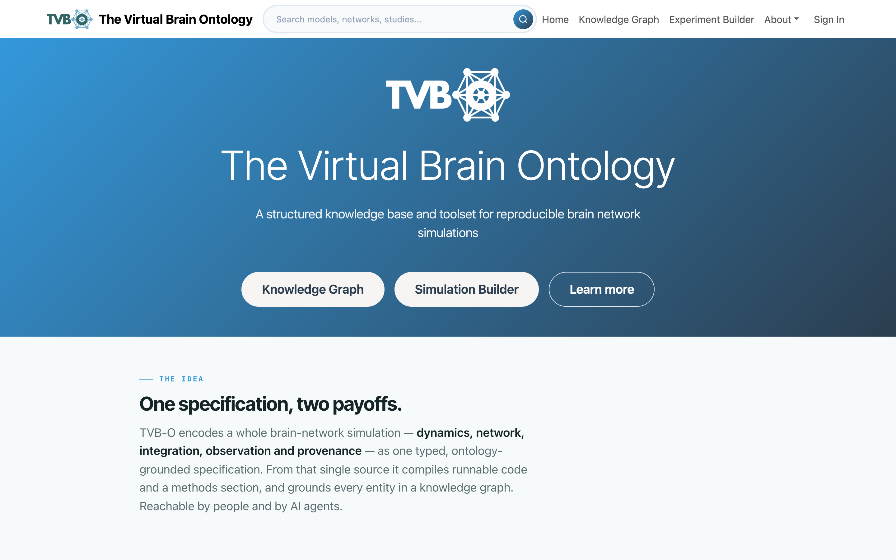{fig-alt="The TVB-O platform home page, with entry points to the knowledge graph, the experiment builder and the account area."}

## ① Explore — the knowledge graph

A searchable catalogue of the ontology: dynamics, networks, integrators, couplings, observation models, atlases, graph generators, and the studies that use them. The same results appear as a filterable grid or as a node-link diagram, and the toggle carries your search and filters across.

::: {.platform-gallery}

::: {.platform-card}
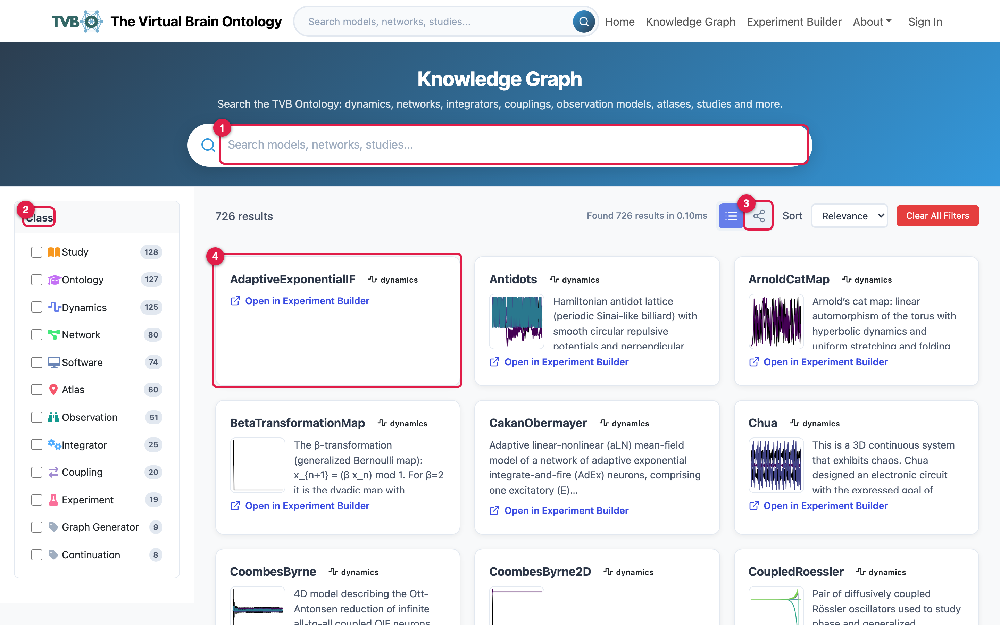{fig-alt="The knowledge graph list view: a search box, a class filter with per-class counts, a view toggle, and a grid of entity cards."}
### List view
Search filters live across names and descriptions; the **Class** facet narrows to Dynamics, Network, Coupling, Study, Atlas and the rest, each with a count.

[Open `/tvbo/kg`](https://tvbo.charite.de/tvbo/kg) · [guide](https://tvbo.charite.de/docs/knowledge-graph-list-view)
:::

::: {.platform-card}
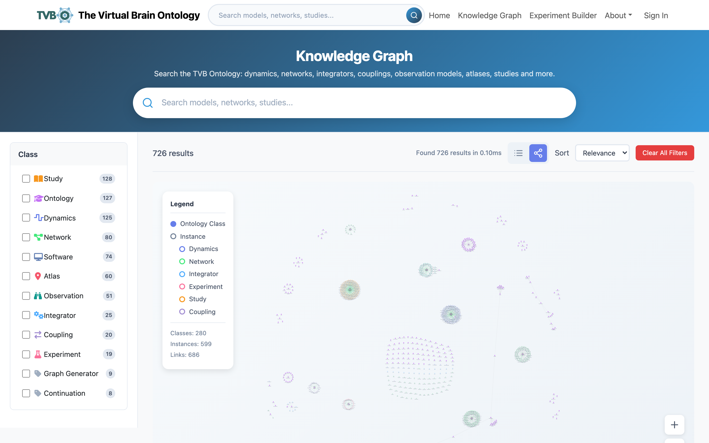{fig-alt="The knowledge graph drawn as an interactive node-link diagram, with entities as nodes and their relationships as edges."}
### Graph view
The same results as a node-link diagram. Edges are the relationships themselves, so it surfaces related entities you did not search for.

[Open `/tvbo/kg`](https://tvbo.charite.de/tvbo/kg) · [guide](https://tvbo.charite.de/docs/knowledge-graph-graph-view)
:::

::: {.platform-card}
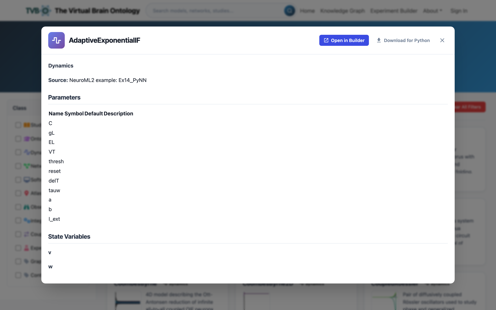{fig-alt="An entity detail card showing a model's description, parameters, state variables, governing equations and related entities."}
### Entity detail
Description, parameters, state variables, governing equations and related entities, with one action that sends the entity straight into the builder.

[Open `/tvbo/kg`](https://tvbo.charite.de/tvbo/kg) · [guide](https://tvbo.charite.de/docs/knowledge-graph)
:::

:::

The same catalogue is reachable from Python with `Dynamics.list_db()` and `Dynamics.from_db(...)`; see [Models & dynamics](../2-specify/Models/index.qmd).

## ② Specify — the experiment builder

A row of tabs, one per part of an experiment, filled in any order against a single working spec that is schema-validated live in the **YAML Specification** panel. Only well-formed experiments export, and an untouched example exports byte-for-byte the curated original.

Three ways to start, mixable: from a curated example, tab by tab, or by sending a component over from the knowledge graph.

::: {.platform-gallery}

::: {.platform-card}
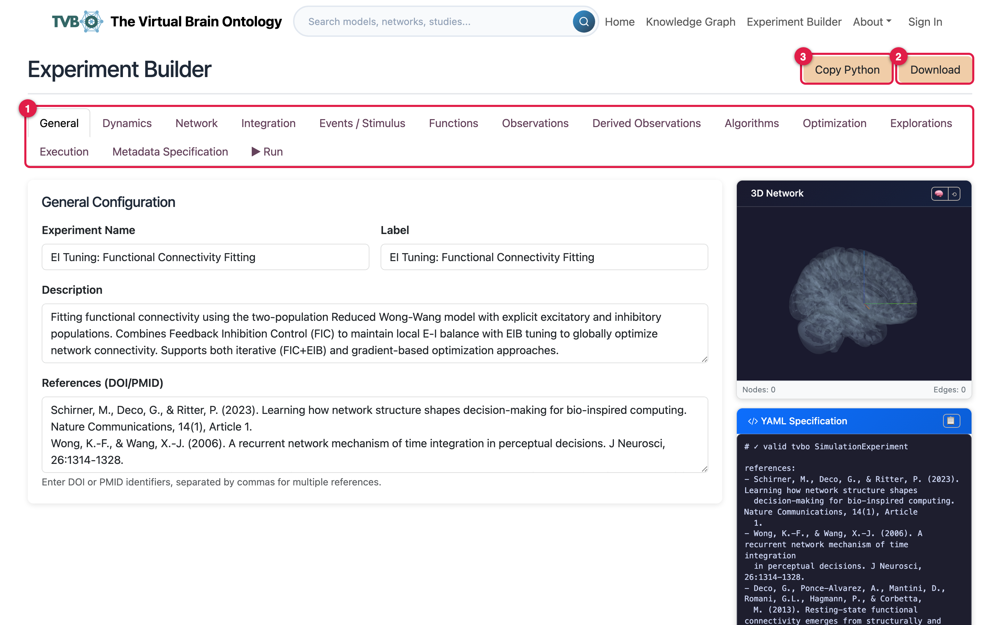{fig-alt="The experiment builder's general tab beside the live YAML specification panel."}
### General
Name, description and integration settings, with the live YAML beside them.

[Open `/tvbo/configurator`](https://tvbo.charite.de/tvbo/configurator) · [guide](https://tvbo.charite.de/docs/experiment-builder-building)
:::

::: {.platform-card}
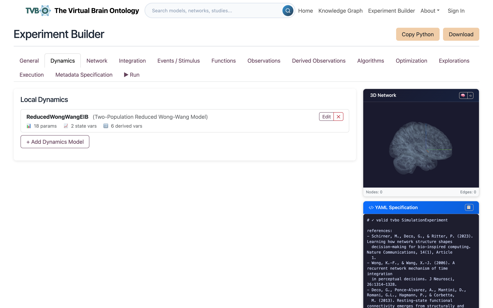{fig-alt="The dynamics tab, choosing a neural mass model and editing its parameters."}
### Dynamics
Pick a curated neural mass model and edit its parameters. This is the `dynamics:` block of [the running example](../2-specify/RunningExample.qmd).

[Open `/tvbo/configurator`](https://tvbo.charite.de/tvbo/configurator) · [docs](../2-specify/Models/index.qmd)
:::

::: {.platform-card}
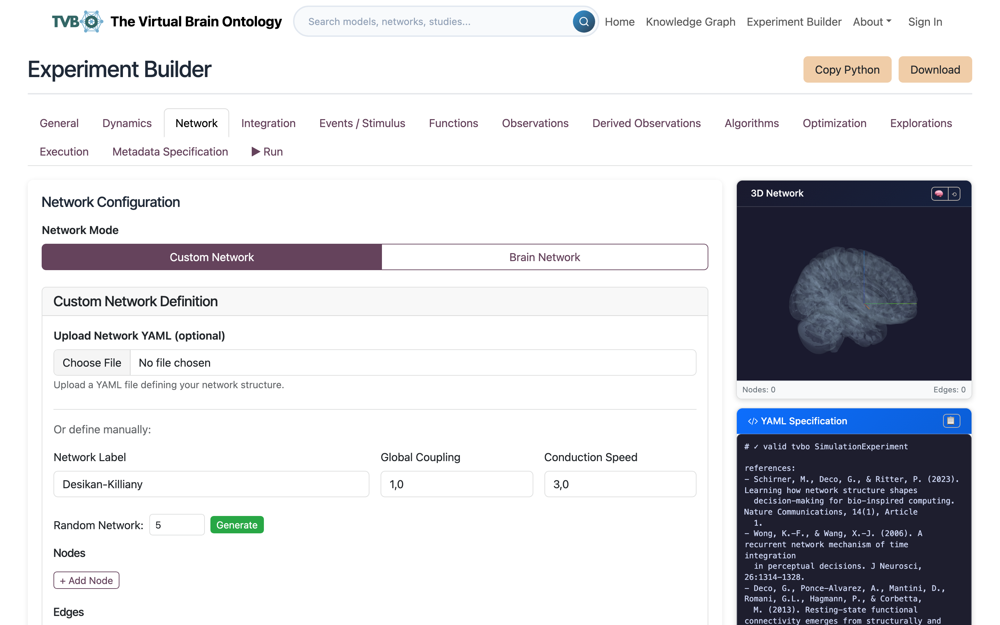{fig-alt="The network tab, choosing a connectome and a coupling function."}
### Network & coupling
Choose a connectome and the coupling that carries activity between its nodes.

[Open `/tvbo/configurator`](https://tvbo.charite.de/tvbo/configurator) · [docs](../2-specify/Networks/Network.qmd)
:::

::: {.platform-card}
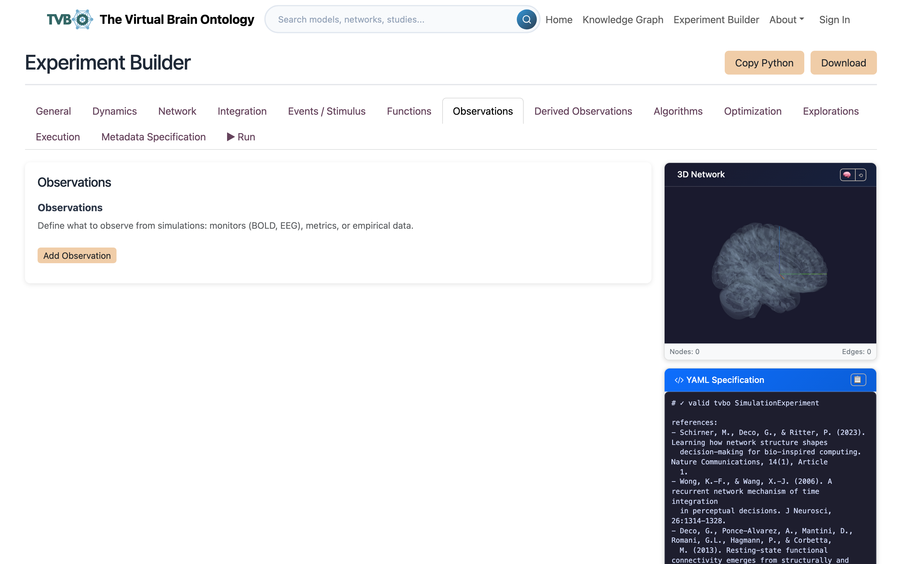{fig-alt="The observations tab, declaring what the simulation should measure."}
### Observations
Declare what the run measures rather than keeping the whole state.

[Open `/tvbo/configurator`](https://tvbo.charite.de/tvbo/configurator) · [docs](../2-specify/Observation/index.qmd)
:::

:::

## ④ Run — in the browser or in Python

::: {.platform-gallery}

::: {.platform-card}
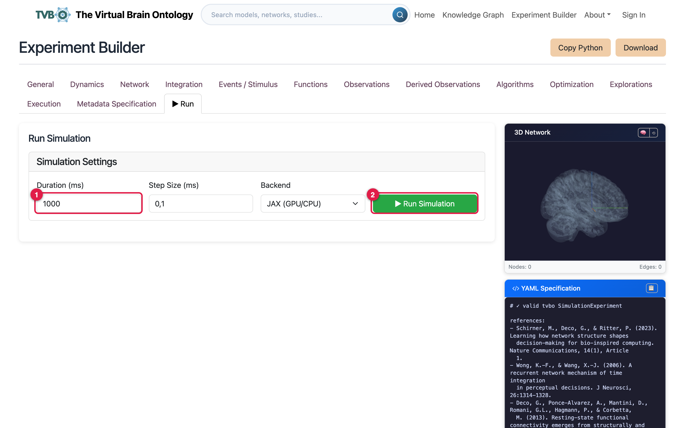{fig-alt="The builder's run tab: duration, step size, a compute backend such as JAX, and the run button."}
### Run in the browser
Set duration, step size and a compute backend such as JAX, then run. The platform executes it with the `tvbo` package and returns the result, which is the quickest way to check an experiment before exporting it.

[Open `/tvbo/configurator`](https://tvbo.charite.de/tvbo/configurator) · [guide](https://tvbo.charite.de/docs/experiment-builder-export)
:::

::: {.platform-card}
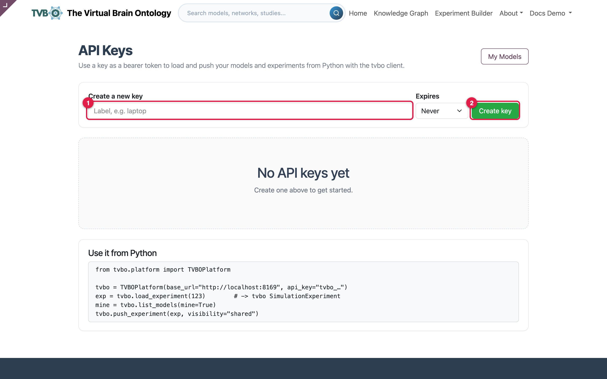{fig-alt="The API keys page, where a key is issued for scripted access."}
### REST API
`GET /api/tvbo/v1/experiments` lists what you can see, `?format=yaml` fetches one, and `POST` saves one back, so a collaborator reproduces a run by id rather than by emailed YAML.

[Open `/my/api-keys`](https://tvbo.charite.de/my/api-keys) · [guide](https://tvbo.charite.de/docs/python-package-api)
:::

:::

**Download** saves the experiment as a YAML bundle plus a companion data file for the connectome matrices; **Copy Python** puts a ready-to-run snippet on the clipboard. For full control over a run, export and use Python: [Run on a backend](../4-run/Backends.qmd) covers what the browser's backend picker is choosing between.

## ⑤ Share — two different things

The platform keeps sharing and publishing separate, and the difference matters.

| | **Share** (peer to peer) | **Publish** (community) |
|---|---|---|
| Who can see it | Only the people you name | Everyone signed in |
| Where it appears | Their **Shared with me** page | The community gallery and the knowledge graph |
| Takes effect | Instantly | Only after review |
| Review | None | Automated validation **and** a human reviewer |
| Good for | Collaboration, feedback, handing a copy to a colleague | Contributing curated, citable content |

You can do both independently: share a draft with a colleague while you work on it, then submit that same element for publication later.

::: {.platform-gallery}

::: {.platform-card}
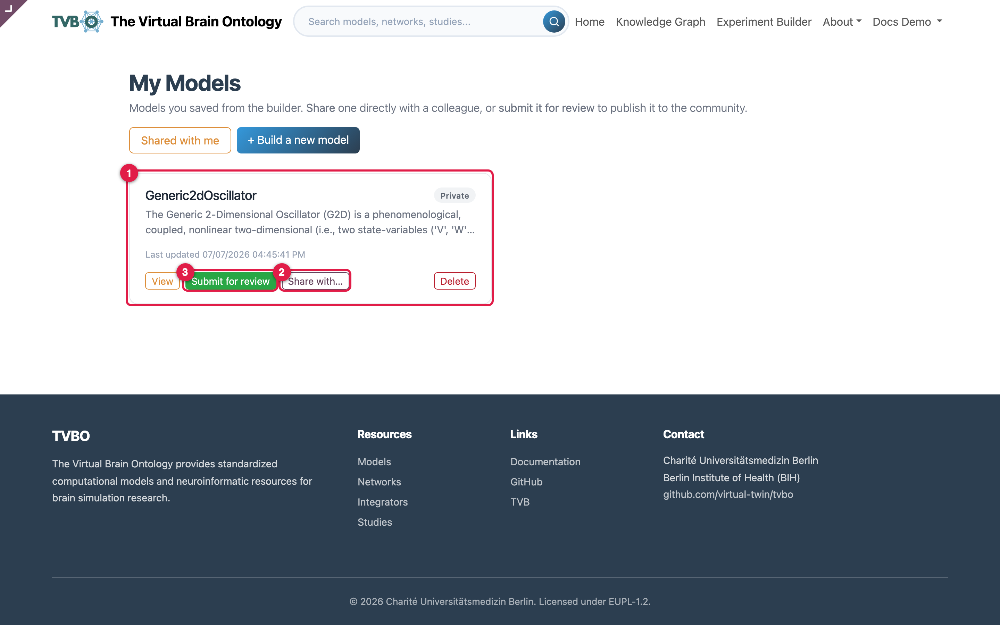{fig-alt="My Models, listing saved elements with their state and their share and submit actions."}
### My models
Saved models and experiments, each showing its state and its **Share** and **Submit** actions. Saved items stay private until you act.

[Open `/my/models`](https://tvbo.charite.de/my/models) · [guide](https://tvbo.charite.de/docs/account-save-to-account)
:::

::: {.platform-card}
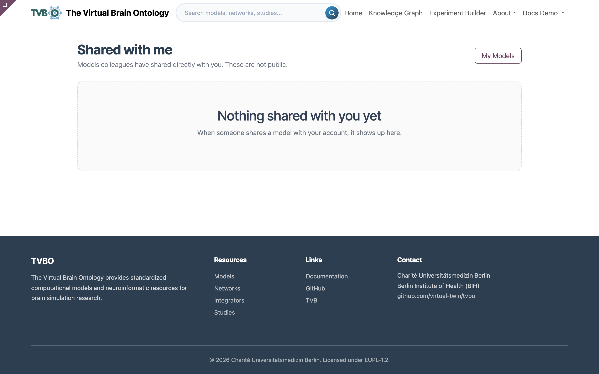{fig-alt="The Shared with me page, listing elements a colleague granted access to."}
### Shared with me
What colleagues granted you access to, instantly and without review. Reached from **My models**, where the sharing is granted.

[Open `/my/models`](https://tvbo.charite.de/my/models) · [guide](https://tvbo.charite.de/docs/account-publishing)
:::

::: {.platform-card}
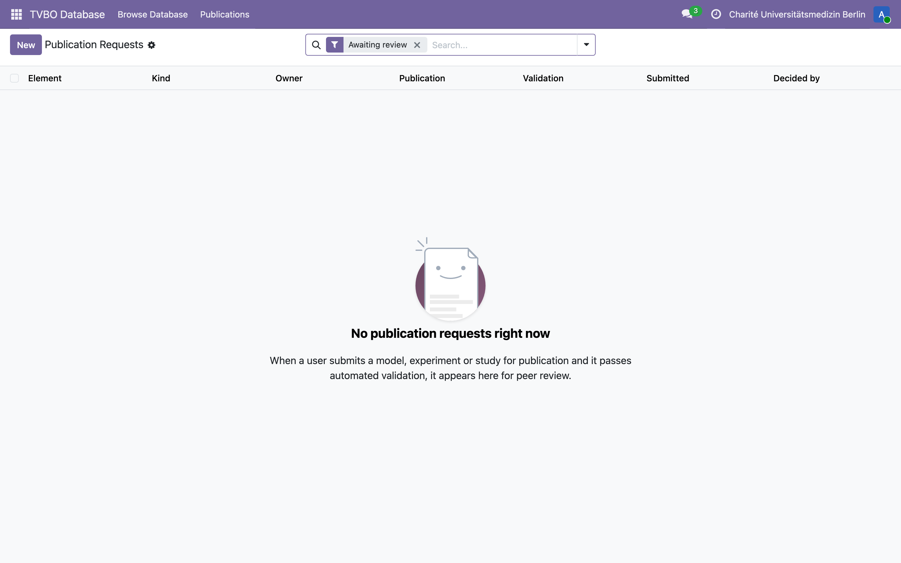{fig-alt="The review-request queue in the backend, colour-coded by state, with filters for state, validation result, element kind and owner."}
### Publication review
Submissions queue for a reviewer, colour-coded by state: amber awaiting review, green published, red validation failed. One approval publishes.

[guide](https://tvbo.charite.de/docs/account-reviewing) *(staff)*
:::

:::

A published result belongs in an archive as well as a gallery: [Results in BIDS](../Interoperability/BIDS/BIDS_comp_modelling.md) and [openMINDS](../Interoperability/OpenMINDS.qmd) cover that side.

## Alongside

::: {.platform-gallery}

::: {.platform-card}
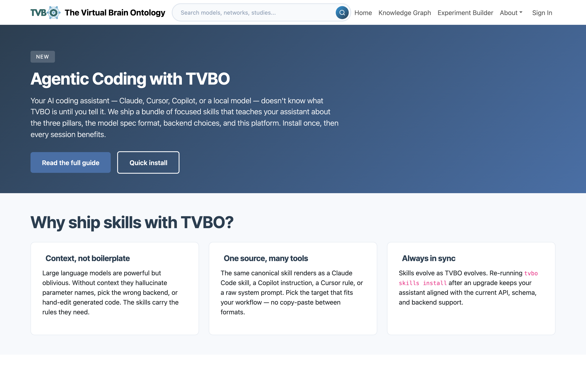{fig-alt="The agentic-coding guide on the platform, with a quick install for the assistant skills."}
### AI agents
A quick install for the assistant skills, then a path from running a curated model to describing an experiment in plain language and letting the assistant write it.

[Open `/tvbo/agents`](https://tvbo.charite.de/tvbo/agents) · [docs](../agents/index.qmd)
:::

::: {.platform-card}
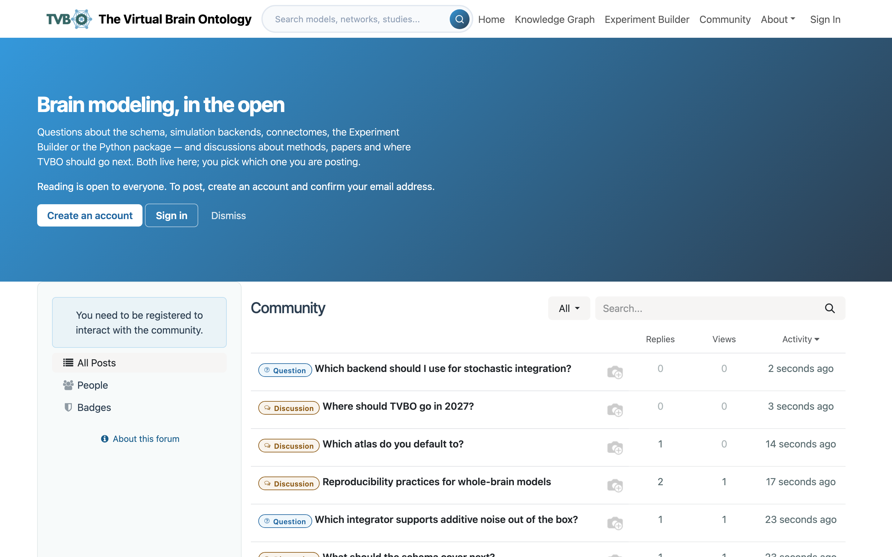{fig-alt="The community forum index, listing discussion and question topics."}
### Forum
One place for both discussion and questions, with karma as the permission system. Built and documented, but not yet reachable on the deployed site.

[guide](https://tvbo.charite.de/docs/forum)
:::

::: {.platform-card}
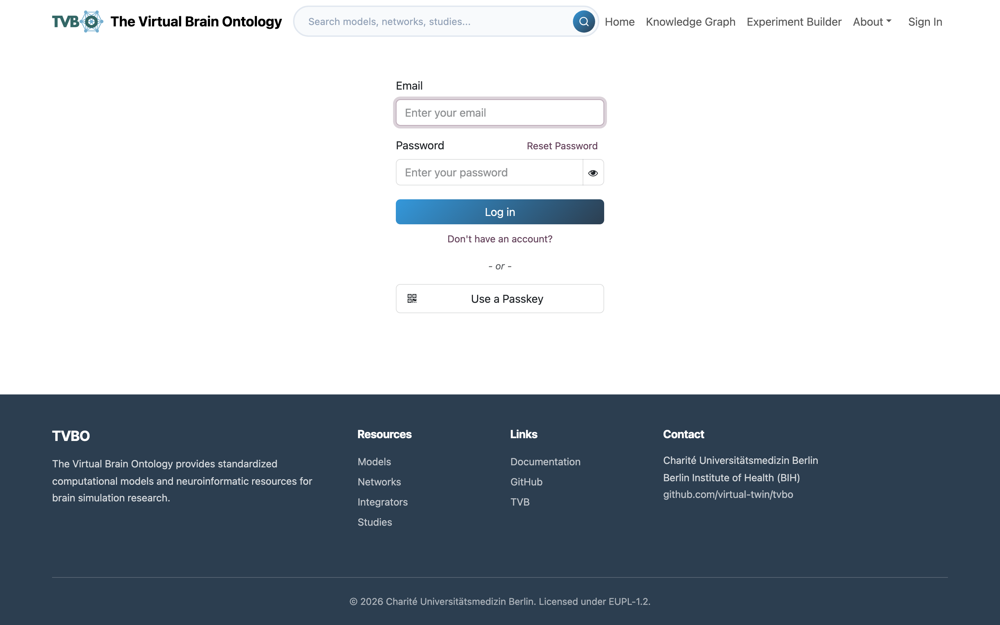{fig-alt="The sign-in screen, taking an email address and a password."}
### Accounts
Email and password, no separate identity provider. Registration takes under a minute and is only needed to keep work, not to do it.

[Open `/web/login`](https://tvbo.charite.de/web/login) · [guide](https://tvbo.charite.de/docs/account-create-account)
:::

:::

## Screencasts

The platform guide carries a short screencast for each area. They play there rather than here, so they stay current with the interface.

| Screencast | Watch |
|---|---|
| Browse the library | [`/docs/home`](https://tvbo.charite.de/docs/home) |
| Find and inspect a model | [`/docs/knowledge-graph`](https://tvbo.charite.de/docs/knowledge-graph) |
| A knowledge-graph tour | [`/docs/knowledge-graph-graph-view`](https://tvbo.charite.de/docs/knowledge-graph-graph-view) |
| The experiment-builder workflow | [`/docs/experiment-builder`](https://tvbo.charite.de/docs/experiment-builder) |
| Build an experiment | [`/docs/experiment-builder-building`](https://tvbo.charite.de/docs/experiment-builder-building) |
| Run an exported experiment in Python | [`/docs/experiment-builder-export`](https://tvbo.charite.de/docs/experiment-builder-export) |
| An account tour | [`/docs/account`](https://tvbo.charite.de/docs/account) |

## What runs it

Three services. Odoo 19 with a custom TVBO module serves the web interface and the knowledge-graph browser; a FastAPI service built from the [`tvbo` image](https://github.com/virtual-twin/tvbo/pkgs/container/tvbo) runs the simulations and the REST API; PostgreSQL holds the database. The compute service is the same open-source package you install locally, so the browser and your laptop execute the same code on the same specification.

The `tvbo` package is at [github.com/virtual-twin/tvbo](https://github.com/virtual-twin/tvbo). The platform module is not yet public.

For anything beyond a check run — sweeps, fitting, cluster jobs — install the package and keep going locally:

```bash
pip install tvbo
```

[Installation](../installation.md) and [Getting started](../GettingStarted.qmd) pick it up from there.
