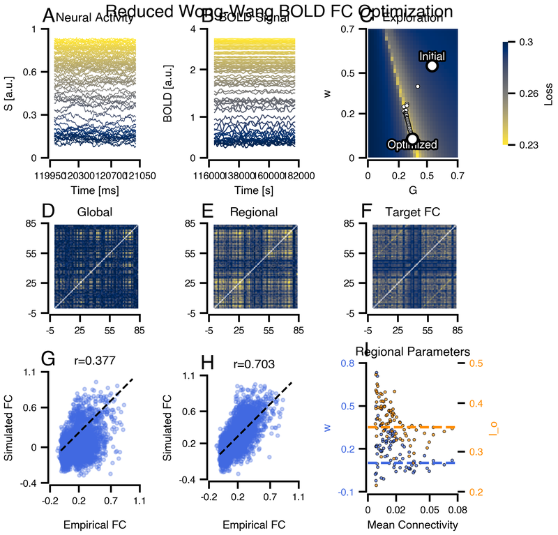
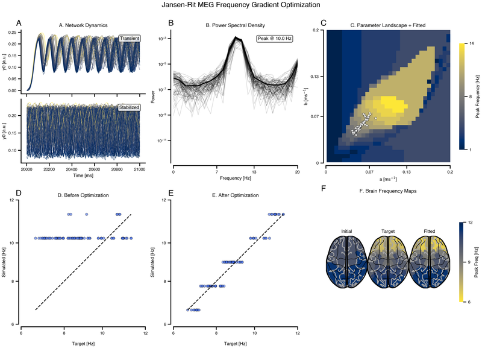
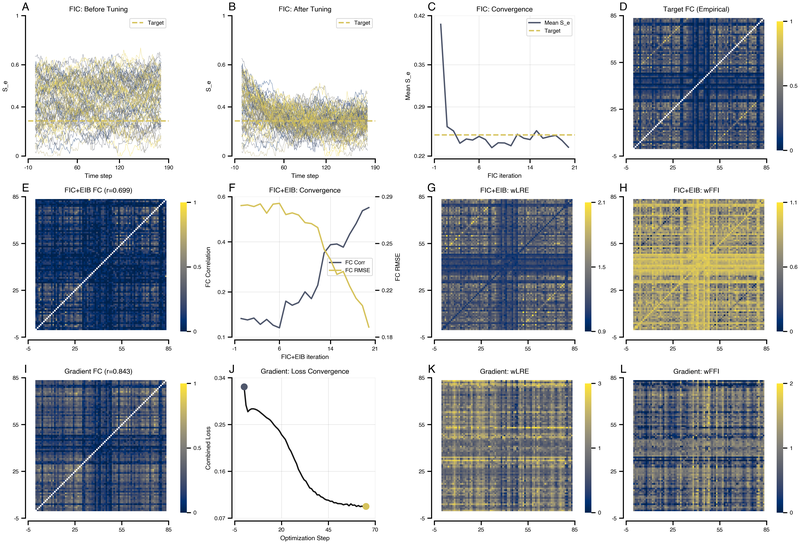
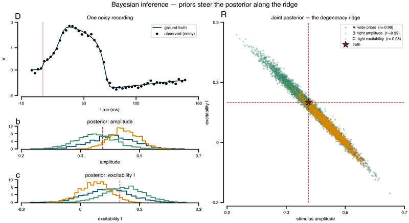
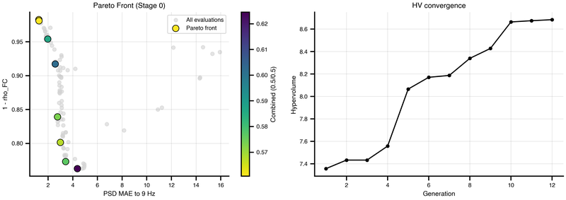
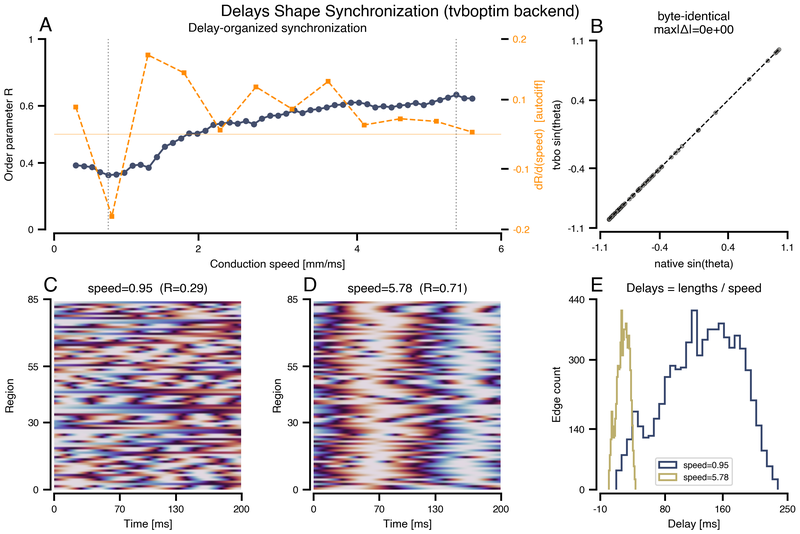

Simulating a model is one thing; making it match data is another. This part of the specification covers three related but distinct jobs, and choosing between them is the first decision.

**Fitting** minimises a loss against a measurement, and gives you one parameter set. **Tuning** drives the model to a target regime with an algorithm rather than a loss, which is what [FIC and E/I balance](Algorithms.qmd) do. **Inference** estimates a distribution over parameters rather than a point, and tells you how well-determined each one actually is.

These workflows run on the tvboptim JAX backend, which is JIT-compiled, differentiable and GPU-capable. If you arrived wanting to know how TVB-O relates to tvboptim as a tool rather than as a backend, see [coming from tvboptim](../../Interoperability/tvboptim/index.qmd).

## What you declare

::: {.cards}
| Page | What it covers | Cover |
|---|---|---|
| [Model fitting](ModelFitting.qmd) | How losses and gradients work here, and what makes a model differentiable. | fa-solid fa-bullseye |
| [Loss functions](LossFunction.qmd) | Declaring the quantity being minimised, symbolically. | fa-solid fa-arrow-down-wide-short |
| [Algorithms (FIC, EIB)](Algorithms.qmd) | Iterative tuning that reaches a regime without a loss. | fa-solid fa-sliders |
:::

## Worked examples

Each of these is a complete study rather than a snippet, and they live in [Examples & Use-Cases](../../examples/index.qmd):

::: {.cards}
| Example | Goal | Cover |
|---|---|---|
| [Reduced Wong-Wang](../../examples/fitting/RWW_tvboptim.qmd) | Match empirical BOLD functional connectivity |  |
| [Jansen-Rit](../../examples/fitting/JR_tvboptim.qmd) | Match a MEG frequency gradient |  |
| [E/I tuning](../../examples/fitting/EI_Tuning_tvboptim.qmd) | Drive regions to a target firing rate |  |
| [Bayesian inference](../../examples/fitting/Bayesian_tvboptim.qmd) | Estimate posteriors over parameters |  |
| [Multi-objective Hopf-Pareto](../../examples/fitting/Hopf_Pareto_tvboptim.qmd) | Trade off competing objectives |  |
| [Delay & speed synchronization](../../examples/fitting/Delay_Speed_Synchronization_tvboptim.qmd) | Fit conduction speed and delays |  |
:::

## Before you trust a fit

A converged optimiser is not the same as a good answer. [Gradient stability & truncated BPTT](../../examples/fitting/TBPTT_tvboptim.qmd) explains why gradients through long chaotic trajectories explode and what truncation buys you. A fitted parameter set that sits on the edge of its search range has almost certainly been truncated rather than found, and [Bifurcation & continuation](../Models/Bifurcation/index.qmd) tells you which dynamical regime the answer landed in.

## Reference

[`Optimization`](../../datamodel/classes/Optimization.qmd) · [`Inference`](../../datamodel/classes/Inference.qmd) · [`LossFunction`](../../datamodel/classes/LossFunction.qmd) · [`Algorithm`](../../datamodel/classes/Algorithm.qmd).
