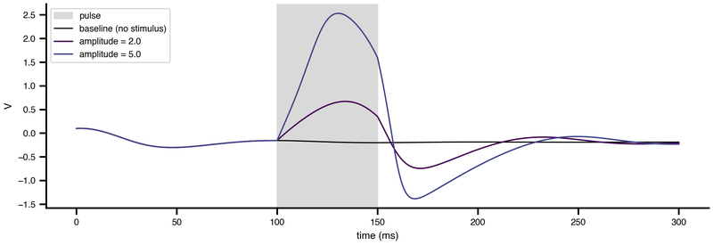

Every TVB-O simulation starts with a dynamical system: the equations that govern one node, before any network exists. You can write those equations yourself, or reference one of the curated models by its ontology IRI and never type them at all.

```{python}
#| label: model-count
#| echo: false
from tvbo import Dynamics

names = Dynamics.list_db()
print(f"{len(names)} curated models, including {', '.join(sorted(names)[:4])} …")
```

Most people start by reusing a curated model and only later declare their own. Both paths use the same specification, so moving from one to the other costs nothing.

## Writing the system

::: {.cards}
| Page | What it covers | Cover |
|---|---|---|
| [Defining dynamical systems](DefineDynamicalSystem.qmd) | Writing a model from scratch, from a damped pendulum to a neural mass. | fa-solid fa-square-root-variable |
| [Initial conditions](InitialConditions.qmd) | Setting the starting state, fixed or sampled from a distribution. | fa-solid fa-flag |
| [Noise & stochastic integration](Noise.qmd) | Additive and multiplicative noise, and what turns an ODE into an SDE. | fa-solid fa-tornado |
| [Events & stimulation](../Events.qmd) | Threshold events, preset-time events, and external stimuli. |  |
| [Unit-aware computations](UnitValidation.qmd) | Keeping a model dimensionally consistent. | fa-solid fa-ruler |
:::

## Solving it

::: {.cards}
| Page | What it covers | Cover |
|---|---|---|
| [Integrators](../Integrators/index.qmd) | The available methods, and when each one is the right choice. | fa-solid fa-timeline |
| [Cross-backend numerical parity](../Integrators/CrossBackendParity.qmd) | Why two backends can disagree about the same model, and the four things that break parity. | fa-solid fa-scale-balanced |
:::

## Beyond one averaged unit

A neural mass is one averaged population per region. When that is too coarse, [Beyond the mean field](BeyondMeanField/index.qmd) covers spiking cells, ion channels and multi-scale models, and [Bifurcation & continuation](Bifurcation/index.qmd) covers finding where a model changes qualitative behaviour.

Once the node is specified, [Networks & connectomes](../Networks/index.qmd) wires many of them into a brain.

## Reference

[`Dynamics`](../../datamodel/classes/Dynamics.qmd) · [`StateVariable`](../../datamodel/classes/StateVariable.qmd) · [`Parameter`](../../datamodel/classes/Parameter.qmd) · the [model gallery](../../examples/dynamics_from_db.qmd).
