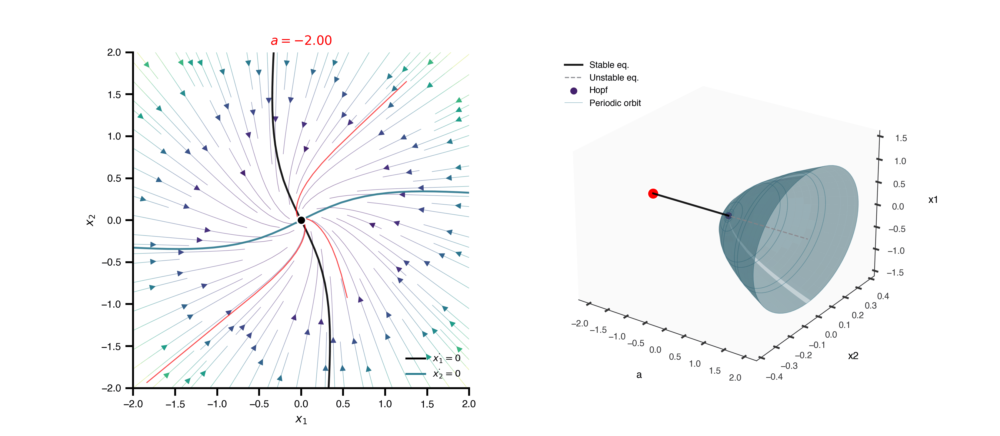

```{python}
from IPython.display import Markdown
from tvbo import Dynamics, Continuation, SimulationExperiment
import matplotlib.pyplot as plt
import numpy as np

HOPF_YAML = r"""
name: HopfNF
description: |
    Supercritical Hopf normal form (Cartesian).
    For $a < 0$ the origin is a stable focus; at $a = 0$ a Hopf bifurcation
    gives birth to a stable limit cycle of radius $\sqrt a$ and angular
    frequency $w$. The legacy figures
    `HopfPhasePortrait_and_BifDiag3D_a={-2,-1,-0.15,0.5,1,1.5}.png` show, for
    each $a$, the 2D phase portrait alongside the 3D bifurcation diagram with
    the periodic-orbit tube.
parameters:
  a: { name: a, value: 0.5 }
  w: { name: w, value: 1.0 }
state_variables:
  x1:
    name: x1
    domain: { lo: -2.0, hi: 2.0 }
    equation:
      lhs: Derivative(x1, t)
      rhs: (a - x1**2 - x2**2)*x1 - w*x2
    initial_value: 0.0
  x2:
    name: x2
    domain: { lo: -2.0, hi: 2.0 }
    equation:
      lhs: Derivative(x2, t)
      rhs: (a - x1**2 - x2**2)*x2 + w*x1
    initial_value: 0.0
"""

dyn_a = Dynamics.from_string(HOPF_YAML)

Markdown(dyn_a.render('markdown'))
```

## Phase portraits across $a$ — animation

The legacy figure series `HopfPhasePortrait_and_BifDiag3D_a=*.png` shows
six static panels for fixed values of $a$. Below we use
`BifurcationResult.animate(...)` further down to generate a single
animation that captures the whole transition from stable focus to limit
cycle alongside the 3D bifurcation diagram. First, the static reference
grid:

## Phase portraits across $a$ — static grid (legacy figures)

For reference, the same six values rendered as a static grid using
`kind='phaseplane'`:

```{python}
a_values = [-2.0, -1.0, -0.15, 0.5, 1.0, 1.5]
fig, axes = plt.subplots(2, 3, figsize=(11, 7.5))
for ax, a in zip(axes.flat, a_values):
    dyn_a.parameters['a'].value = a
    dyn_a.plot("x1", "x2", kind="phaseplane", ax=ax,
               grid_n=22, n_trajectories=2, duration=15)
    ax.set_title(f"$a = {a}$")
    ax.set_xlim(-2, 2); ax.set_ylim(-2, 2)
plt.tight_layout(); plt.show()
```

## Bifurcation diagram with limit-cycle continuation

A single 1-parameter sweep in $a$ for the equilibrium branch, plus a nested
branch that picks up periodic orbits from each detected Hopf point:

```{python}
dyn = Dynamics.from_string(HOPF_YAML)

CONT_YAML = """
name: hopf_in_a
dynamics: HopfNF
free_parameters:
  - name: a
    domain: { lo: -2.0, hi: 2.0 }
max_steps: 400
ds: 0.01
bothside: true
branches:
  - name: po_from_hopf
    source_point: "hopf:all"
    bothside: true
"""

cont = Continuation.from_string(CONT_YAML)
exp = SimulationExperiment(dynamics=dyn, continuations=[cont])
result = exp.run("bifurcationkit.jl")
hopf = result.continuations["hopf_in_a"]
hopf.plot(VOI="x1")
```

## 3D bifurcation diagram

The full picture: equilibrium spine (with stability colouring), Hopf point,
and the limit-cycle tube whose radius grows like $\sqrt a$:

```{python}
hopf.plot_3d(VOI="x1")
```

## Combined sweep: phase portrait + 3D diagram

`BifurcationResult.animate(...)` ties the two views together. The left
panel re-renders the phase portrait at the current value of $a$; the
right panel shows the 3D diagram once with a moving red marker that
tracks the position on the equilibrium backbone.

```{python}
anim = hopf.animate(dyn, "a", np.linspace(-2.0, 1.5, 24),
                    "x1", "x2", VOI="x1",
                    grid_n=18, n_trajectories=3, duration=15,
                    figsize=(11, 4.8),
                    title_fmt=r"$a = {value:+.2f}$")
anim.save("hopf_sweep.gif", writer="pillow", fps=8)
```



## AUTO-07p (NumCont)

Mirrors the standalone `PhasePortraitHopf.py` example: AUTO-07p
time-integrates from the YAML defaults to a stable focus (or limit cycle),
sweeps $a$ in both directions, and -- when the equilibrium branch yields a
Hopf label -- continues the periodic orbit out via the nested branch
declared above as `source_point: "hopf:all"`.

```{python}
result_auto = exp.run("auto-07p")
hopf_auto = result_auto.continuations["hopf_in_a"]
hopf_auto.plot(VOI="x1")
```

The 3D view uses the unified style registry: stable LC segments are
rendered as a tube surface, unstable ones as a wireframe.

```{python}
hopf_auto.plot_3d(VOI="x1")
```

This single TVBO experiment reproduces the entire figure series of the
legacy tutorial -- without writing a `model.f90`, without a global
continuation registry, and using only the YAML strings declared above.
