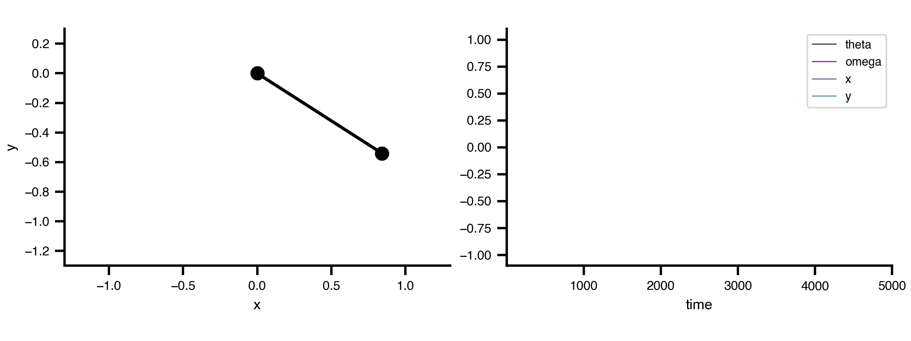

This guide demonstrates how to define and simulate a Dynamical System using TVBO's specification language.

## Example: Damped Pendulum

We'll create a simple damped pendulum system to illustrate the key concepts.



### System Specification

Define the pendulum [Dynamics](/datamodel/classes/Dynamics.html) using YAML format with [Parameter](/datamodel/classes/Parameter.html)s, [state variables](/datamodel/classes/StateVariable.html), and [output transforms](/datamodel/slots/output.html):

```{python}
#| echo: false
import matplotlib.pyplot as plt
import matplotlib.animation as animation
from IPython.display import HTML, Image
import bsplot
bsplot.style.use('tvbo')
```

```{python}
import yaml
from tvbo import Dynamics, SimulationExperiment

# Pendulum System
pendulum_dynamics = """
name: PendulumSystem
description: A simple damped pendulum system for demonstrating TVBO capabilities.
parameters:
    c:
        description: Damping coefficient
        value: 0.001
        unit: 1/ms
    omega0:
        description: Natural frequency
        value: 0.01
        unit: rad/ms
    L:
        description: Length of the pendulum
        unit: m
        value: 1.0
state_variables:
    theta:
        description: Angle of the pendulum
        unit: rad
        initial_value: 1.0
        equation:
            rhs: omega
    omega:
        description: Angular velocity
        unit: rad/ms
        initial_value: 0.0
        equation:
            rhs: -c*omega - omega0**2 * sin(theta)
derived_variables:
    x:
        description: X coordinate of the pendulum bob
        unit: m
        equation:
            rhs: L * sin(theta)
    y:
        description: Y coordinate of the pendulum bob
        unit: m
        equation:
            rhs: -L * cos(theta)
output:
    - x
    - y
"""

pendulum = SimulationExperiment(
    dynamics=Dynamics.from_string(pendulum_dynamics),
)
results = pendulum.run('tvboptim', duration=5_000)
```

The system consists of:

- **[Parameters](/datamodel/classes/Parameter.html)**: Physical constants (damping, frequency, length)
- **[State variables](/datamodel/classes/StateVariable.html)**: Time-evolving quantities (angle θ, angular velocity ω)
- **[Output transforms](/datamodel/slots/output.html)**: Computed observables (Cartesian coordinates x, y)

### Visualization

Real-time animation of the pendulum motion alongside the time series data:

```{python}
# | echo: false
ani = results.integration.animate('pendulum', save="_output/anim1.gif")
```

### Phase Portrait

State variables accept a [Distribution](/datamodel/classes/Distribution.html) for initial conditions. The presence of a distribution declares that the variable should be sampled, with no runtime flags needed. The resolution order is:

| Configuration | Behavior |
|---|---|
| `initial_value: 1.0` (no distribution) | Deterministic; always starts at 1.0 |
| `distribution:` present + `n_trials > 1` | Each trial samples a new IC from the distribution |
| `distribution:` present, single run | Uses `initial_value` as fallback |
| `distribution.domain` not set | Falls back to the state variable's `domain` |

```yaml
# Case 1: Fixed IC (no distribution)
theta:
    initial_value: 1.0        # → Always starts at 1.0

# Case 2: Sampled IC (distribution present)
theta:
    initial_value: 0.0        # fallback if sampling disabled
    distribution:
        name: Uniform
        domain: {lo: -3.14, hi: 3.14}
    # → Sampled when n_trials > 1, else uses 0.0

# Case 3: Distribution without explicit domain → inherits SV domain
theta:
    initial_value: 0.0
    domain: {lo: -3.14, hi: 3.14}
    distribution:
        name: Uniform         # domain falls back to SV domain
    # → Uniform(-3.14, 3.14)
```

An [Exploration](/datamodel/classes/Exploration.html) with `n_trials` runs them in parallel, and each trial samples a different starting point, revealing the full phase portrait without any Python loop:

```{python}
from tvbo.datamodel.schema import Distribution, Range, Exploration
import numpy as np
# Attach sampling distributions to the state variables
pendulum.dynamics.state_variables["theta"].distribution = Distribution(
    name="Uniform", domain=Range(lo=-np.pi, hi=np.pi)
)
pendulum.dynamics.state_variables["omega"].distribution = Distribution(
    name="Uniform", domain=Range(lo=-0.005,hi=0.005)
)
# 20 parallel trials from different initial conditions
pendulum.explorations["ICs"] = Exploration(name="ICs", n_trials=20)
result = pendulum.run(duration=10_000)
```

```{python}
import numpy as np
import matplotlib.pyplot as plt


def plot_phase_portrait(trials, color_trajectory_by="theta", color_ic_by=None,
                        cmap="coolwarm", ic_cmap=None, ax=None):
    """Plot phase portrait with independent coloring for trajectories and ICs.

    color_trajectory_by: "theta" or "omega" — colors lines by that IC value
    color_ic_by: "theta" or "omega" — colors IC dots (None = black)
    """
    label_map = {"theta": r"$\theta_0$", "omega": r"$\omega_0$"}

    if ax is None:
        fig, ax = plt.subplots(figsize=(5, 4), layout="compressed")
    else:
        fig = ax.figure
    ax.set_box_aspect(1)

    # `trials` is a labelled DataArray with dims (trial, time, variable, node),
    # so every axis is selected by name — no positional indices to drift out of
    # sync if the intrinsic rank changes.
    #
    # The exploration records the declared outputs (x, y). The pendulum geometry
    # is x = L sin(theta), y = -L cos(theta), so the phase-plane coordinates come
    # back exactly: theta = atan2(x, -y), and omega = d(theta)/dt.
    dt = float(trials.coords["time"].values[1] - trials.coords["time"].values[0])

    def state_of(tid):
        run = trials.sel(trial=tid)
        x = run.sel(variable="x").squeeze(drop=True).values
        y = run.sel(variable="y").squeeze(drop=True).values
        theta = np.unwrap(np.arctan2(x, -y))
        omega = np.gradient(theta, dt)
        return theta, omega

    trial_ids = trials.coords["trial"].values
    states = {int(t): state_of(t) for t in trial_ids}
    var_pos = {"theta": 0, "omega": 1}

    def ic_of(var):
        """Initial value of `var` for each trial."""
        k = var_pos[var]
        return np.array([states[int(t)][k][0] for t in trial_ids])

    # Trajectory colors
    traj_ics = ic_of(color_trajectory_by)
    traj_norm = plt.Normalize(float(traj_ics.min()), float(traj_ics.max()))
    traj_cm = plt.colormaps[cmap]

    # IC dot colors
    if color_ic_by is not None:
        ic_vals = ic_of(color_ic_by)
        ic_norm = plt.Normalize(float(ic_vals.min()), float(ic_vals.max()))
        ic_cm = plt.colormaps[ic_cmap or cmap]

    for i, tid in enumerate(trial_ids):
        theta, omega = states[int(tid)]
        ax.plot(theta, omega, lw=0.6, alpha=0.7, color=traj_cm(traj_norm(traj_ics[i])))
        dot_color = ic_cm(ic_norm(ic_vals[i])) if color_ic_by else "black"
        ax.plot(theta[0], omega[0], "o", ms=4, color=dot_color, zorder=5)

    # Colorbars
    sm = plt.cm.ScalarMappable(cmap=traj_cm, norm=traj_norm)
    fig.colorbar(sm, ax=ax, label=f"traj: {label_map[color_trajectory_by]}")
    if color_ic_by is not None:
        sm2 = plt.cm.ScalarMappable(cmap=ic_cm, norm=ic_norm)
        fig.colorbar(sm2, ax=ax, label=f"IC: {label_map[color_ic_by]}")

    ax.set_xlabel(r"$\theta$")
    ax.set_ylabel(r"$\omega$")
    plt.close()
    return fig


trials = result.exploration.ICs.as_grid()   # labelled: (trial, time, variable, node)
plot_phase_portrait(trials, color_trajectory_by="theta", color_ic_by="omega",
                    cmap="coolwarm", ic_cmap="plasma")
```


