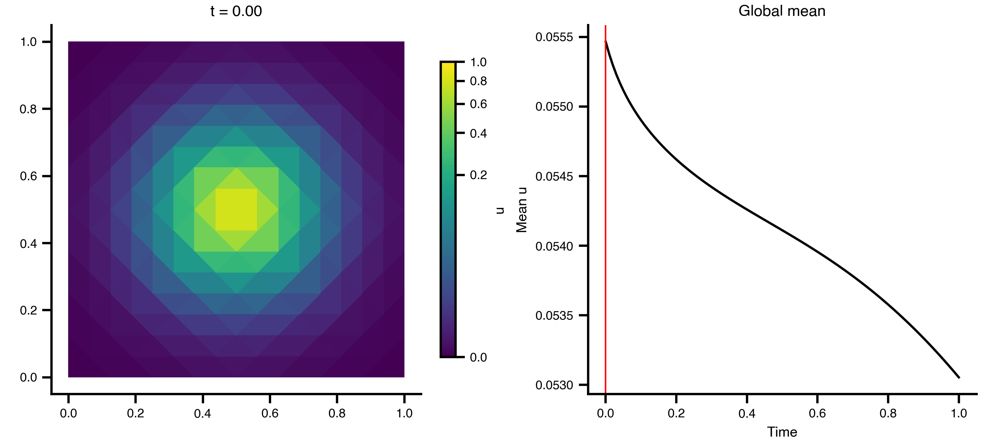
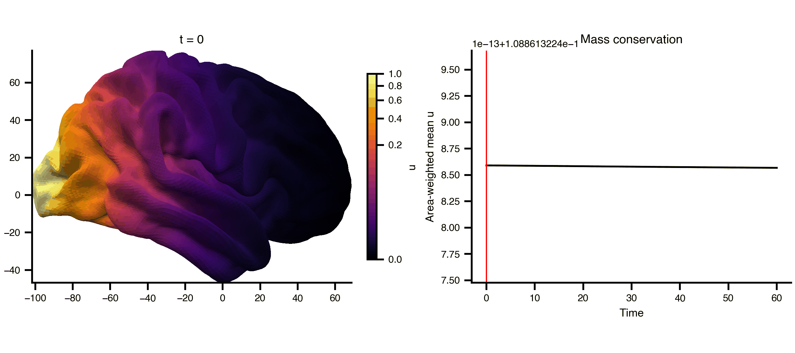

TVB-O integrates partial differential equations on a mesh with linear finite elements. The PDE backend generates a self-contained solver from a YAML experiment description, supporting triangle meshes (flat, or a curved surface in space, which is the cortical case) as well as tetrahedral meshes via [scikit-fem](https://scikit-fem.readthedocs.io/), Dirichlet boundary conditions, declared `events:` as drives, and spatially varying coefficients.

**The declared equation is the operator that runs.** Each state variable's `equation.rhs` is parsed into mass and stiffness blocks, so a system is lowered to

$$
M\,\dot{\mathbf{u}} = A\,\mathbf{u} + M\,\mathbf{f}(\mathbf{u},t)
$$

with one block row per state variable. Terms that are linear in the state go into $A$ and are solved implicitly, which is unconditionally stable and lets the step size follow accuracy rather than a stability limit; anything else is evaluated at the current state each step. Because the constraint set and $A$ are fixed, the sparse factorisation is computed once and every step is a triangular solve.

That covers rather more than diffusion:

| You can write | Because |
|---|---|
| `D * laplacian(u)` | the classic heat equation |
| `D * laplacian(u) - k * u` | reaction terms become mass blocks |
| a system of several `state_variables` | one block row each, so second-order-in-time systems (waves) work |
| `div(c * grad(u))` with per-vertex `c` | weighted stiffness assembly — a heterogeneous medium |
| a term naming an `events:` entry | the stimulus is substituted into the equation and evaluated each step |

Time integration is **Crank–Nicolson** by default (second-order accurate and non-dissipative, which matters for waves: backward Euler damps oscillations artificially). Set `method: implicit Euler` for the first-order, strongly damping alternative.

$$
\partial_t u(t,\mathbf{x}) = D\,\Delta u(t,\mathbf{x}) \quad \text{in } \Omega, \qquad u(t,\mathbf{x}) = 0 \quad \text{on } \partial\Omega
$$

## Example 1: Heat Equation on a 2D Grid {#sec-pde-2d-grid}

A minimal diffusion example on a unit square, using scikit-fem's built-in mesh generators.

### Step 1 — Create a triangle mesh and experiment YAML

```{python}
import tempfile, os, yaml
import meshio
import numpy as np
from skfem import MeshTri
from bsplot import style
style.use("tvbo")

# Generate a symmetric unit-square triangulation
mesh = MeshTri.init_symmetric().refined(3)
tmpdir = tempfile.mkdtemp()
mesh_path = os.path.join(tmpdir, "unit_square.msh")
meshio.Mesh(points=mesh.p.T, cells=[("triangle", mesh.t.T)]).write(mesh_path)
print(f"Mesh: {mesh.p.shape[1]} vertices, {mesh.t.shape[1]} triangles")

# Write experiment YAML
exp_dict = {
    "label": "Heat equation on unit square",
    "field_dynamics": {
        "label": "Heat / diffusion equation",
        "mesh": {
            "label": "unit_square",
            "element_type": "triangle",
            "mesh_file": mesh_path,
        },
        "parameters": {"D": {"name": "D", "value": 0.01}},
        "state_variables": [
            {
                "name": "u",
                "label": "Temperature",
                "initial_value": 0.0,
                "boundary_conditions": [
                    {
                        "label": "Zero Dirichlet",
                        "bc_type": "Dirichlet",
                        "equation": "0",
                    }
                ],
                "equation": {"lhs": "u_t", "rhs": "D * laplacian(u)"},
            }
        ],
        "operators": [
            {"label": "Diffusion", "operator_type": "laplacian", "coefficient": "D"}
        ],
        "solver": {
            "label": "FEM implicit Euler",
            "discretization": "FEM",
            "method": "implicit Euler",
            "dt": 0.01,
        },
    },
    "integration": {"duration": 1.0},
}
yaml_path = os.path.join(tmpdir, "pde_heat_2d.yaml")
with open(yaml_path, "w") as f:
    yaml.dump(exp_dict, f)
```

### Step 2 — Run the simulation

```{python}
from tvbo import SimulationExperiment

exp = SimulationExperiment.from_file(yaml_path)
ns = exp.execute("pde")
nodes = ns["meta"]["nodes"]
x, y = nodes[0], nodes[1]

# Gaussian bump initial condition centred at (0.5, 0.5)
u0 = np.exp(-((x - 0.5)**2 + (y - 0.5)**2) / 0.02)

ts = exp.run("pde", u0=u0)
print(f"TimeSeries: {ts.data.shape}  (time, state_var, nodes)")
print(f"Time: {ts.time[0]:.2f} to {ts.time[-1]:.2f}, dt={ts.time[1] - ts.time[0]:.3f}")
```

### Step 3 — Animate the diffusion

```{python}
import matplotlib.pyplot as plt
import matplotlib.tri as mtri
from matplotlib.colors import PowerNorm
from matplotlib.animation import PillowWriter
from IPython.display import Image

triang = mtri.Triangulation(x, y, ns["meta"]["cells"].T)
n_frames = ts.data.shape[0]
vmin, vmax = 0, float(np.max(ts.data))
norm = PowerNorm(gamma=0.3, vmin=vmin, vmax=vmax)

fig, (ax_mesh, ax_ts) = plt.subplots(1, 2, figsize=(9, 4), layout="compressed")

# Add a fixed colorbar (norm is constant across frames)
import matplotlib.cm as cm
sm = cm.ScalarMappable(norm=norm, cmap="viridis")
fig.colorbar(sm, ax=ax_mesh, label="u", shrink=0.8)

def update_2d(frame):
    ax_mesh.clear()
    ax_mesh.tripcolor(triang, np.asarray(ts.data[frame, 0, :]), norm=norm, cmap="viridis")
    ax_mesh.set_title(f"t = {ts.time[frame]:.2f}")
    ax_mesh.set_aspect("equal")

    ax_ts.clear()
    ax_ts.plot(ts.time, np.asarray(ts.data[:, 0, :]).mean(axis=1), color="black")
    ax_ts.axvline(ts.time[frame], color="red", lw=1)
    ax_ts.set_xlabel("Time")
    ax_ts.set_ylabel("Mean u")
    ax_ts.set_title("Global mean")

os.makedirs("_output", exist_ok=True)
from matplotlib.animation import FuncAnimation
anim = FuncAnimation(fig, update_2d, frames=n_frames, interval=100)
anim.save("_output/pde_heat_2d.gif", writer="pillow", fps=10)
plt.close()
```




## Example 2: Cortical Surface Diffusion {#sec-pde-cortex}

Diffusion on a cortical surface mesh (fsLR 32k), using the `mesh_file` attribute to reference an external GIFTI file directly. The cortical midthickness surface is a closed manifold (no boundary), so the Dirichlet BC has no effect and total mass is conserved, so the field spreads but doesn't decay.

### Setup and run

```{python}
import templateflow.api as tfa
import nibabel as nib

# Get RH midthickness surface from templateflow
mesh_gii = str(tfa.get(template="fsLR", density="32k", suffix="midthickness", hemi="R", desc=None))

# D=50 gives visible spreading on mm-scale cortical mesh (edge ≈ 1.6 mm)
exp_cortex = {
    'label': 'Cortical surface diffusion',
    'field_dynamics': {
        'label': 'Heat/diffusion equation',
        'mesh': {
            'label': 'cortex_rh',
            'element_type': 'triangle',
            'mesh_file': mesh_gii,
            'mesh_format': 'gifti',
        },
        'parameters': {'D': {'name': 'D', 'value': 50.0}},
        'state_variables': [{
            'name': 'u', 'label': 'u',
            'initial_value': 0.0,
            'boundary_conditions': [{'label': 'Zero Dirichlet', 'bc_type': 'Dirichlet', 'equation': '0'}],
            'equation': {'lhs': 'u_t', 'rhs': 'D * laplacian(u)'},
        }],
        'operators': [{'label': 'Diffusion', 'operator_type': 'laplacian', 'coefficient': 'D'}],
        'solver': {'label': 'FEM IE', 'discretization': 'FEM', 'method': 'implicit Euler', 'dt': 2.0},
    },
    'integration': {'duration': 60},
}

tmpdir2 = tempfile.mkdtemp()
yaml_path2 = os.path.join(tmpdir2, 'pde_cortex.yaml')
with open(yaml_path2, 'w') as f:
    yaml.dump(exp_cortex, f)

exp2 = SimulationExperiment.from_file(yaml_path2)

# Load mesh for initial condition
gi = nib.load(mesh_gii)
vertices = gi.darrays[0].data

# Gaussian centred at the most posterior vertex (occipital pole), σ ≈ 45 mm
seed_idx = np.argmin(vertices[:, 1])
seed = vertices[seed_idx]
dist_sq = np.sum((vertices - seed)**2, axis=1)
u0 = np.exp(-dist_sq / 2000)

ts2 = exp2.run("pde", u0=u0)
print(f"Cortical PDE: {ts2.data.shape}, {vertices.shape[0]} vertices")
```

### Animate with bsplot

```{python}
from matplotlib.colors import PowerNorm
from bsplot.surface import plot_surf
from bsplot.animate import animate_axes


n_frames = ts2.data.shape[0]
vmax2 = float(np.max(ts2.data))
norm2 = PowerNorm(gamma=0.3, vmin=0, vmax=vmax2)

fig2, (ax_surf, ax_ts) = plt.subplots(1, 2, figsize=(9, 4), layout="compressed")

# Add a fixed colorbar
import matplotlib.cm as cm
sm2 = cm.ScalarMappable(norm=norm2, cmap="inferno")
fig2.colorbar(sm2, ax=ax_surf, label="u", shrink=0.8)

# The conserved quantity is 1'Mu, so weight by the mass matrix the solver integrates
# rather than by a second, hand-rolled notion of vertex area.
from tvbo.data.mesh_fem import p1_mass

M_cortex = p1_mass(vertices, gi.darrays[1].data)
vertex_areas = np.asarray(M_cortex.sum(axis=1)).ravel()
global_mean = np.array([
    (vertex_areas * np.asarray(ts2.data[t, 0, :])).sum() / vertex_areas.sum()
    for t in range(n_frames)
])

def cortex_update(frame, ax, axis_idx, context):
    ax.clear()
    if axis_idx == 0:
        overlay = np.asarray(context["ts"].data[frame, 0, :])
        plot_surf(
            context["gii"], overlay=overlay,
            hemi="rh", view="lateral", ax=ax,
            cmap="inferno", norm=context["norm"],
        )
        ax.set_title(f"t = {context['ts'].time[frame]:.0f}")
        return []
    else:
        ax.plot(context["ts"].time, context["mean"], color="black")
        ax.axvline(context["ts"].time[frame], color="red", lw=1)
        ax.set_xlabel("Time")
        ax.set_ylabel("Area-weighted mean u")
        ax.set_title("Mass conservation")
        return []

ctx = {"ts": ts2, "gii": gi, "norm": norm2, "mean": global_mean}
anim2 = animate_axes(fig2, [ax_surf, ax_ts], n_frames=n_frames,
                     update_fn=cortex_update, context=ctx, interval=200)
anim2.save("_output/pde_cortex.gif", writer="pillow", fps=6)
plt.close()
```




## Example 3: A damped wave equation with a heterogeneous medium {#sec-pde-wave}

A second-order-in-time system, written as two first-order state variables, with a spatially varying propagation scale. This is the neural-field form used by geometric eigenmode models [@Pang2023], generalised: those fit a single $r_s$ for the whole cortex, which the modal route requires. Vary $r_s$ in space and the operator stops being diagonal in the eigenbasis, so only a field formulation reaches this regime.

$$
\gamma^{-2}\,\partial_{tt}\phi + 2\gamma^{-1}\,\partial_t\phi + \phi - \nabla\!\cdot\!\big(r_s(\mathbf{x})^2 \nabla \phi\big) = Q
$$

```{python}
gamma = 2.0
exp_wave = {
    'label': 'Damped wave with heterogeneous propagation scale',
    'field_dynamics': {
        'label': 'Damped wave',
        'mesh': {'label': 'unit_square', 'element_type': 'triangle', 'mesh_file': mesh_path},
        # A parameter with no scalar value is a PER-VERTEX field. Give it a `producer:` and
        # the run needs no caller at all; passed to build() here so the sweep below can vary it.
        'parameters': {'g': {'name': 'g', 'value': gamma}, 'rsq': {'name': 'rsq', 'value': None}},
        'state_variables': [
            {'name': 'phi', 'label': 'phi', 'initial_value': 1.0,
             'equation': {'lhs': 'phi_t', 'rhs': 'w'}},
            {'name': 'w', 'label': 'w', 'initial_value': 0.0,
             'equation': {'lhs': 'w_t', 'rhs': 'g**2 * (-(2/g)*w - phi + div(rsq * grad(phi)))'}},
        ],
        'solver': {'label': 'CN', 'discretization': 'FEM', 'method': 'crank-nicolson', 'dt': 0.005},
    },
    'integration': {'duration': 2.0},
}
yaml_path3 = os.path.join(tmpdir, 'pde_wave.yaml')
with open(yaml_path3, 'w') as f:
    yaml.dump(exp_wave, f)

exp3 = SimulationExperiment.from_file(yaml_path3)
ns3 = exp3.execute('pde')
print("per-vertex fields this system needs:", ns3['meta']['requires_fields'])

# Fast propagation on the left half, slow on the right
xs = MeshTri.init_symmetric().refined(3).p[0]
solve3, _, meta3 = ns3['build'](fields={'rsq': np.where(xs < 0.5, 0.05, 0.005)})
_, U3 = solve3(steps=400, save_timeseries=True)
print(f"states: {meta3['variables']}, U shape {U3.shape}")
```

For the spatially uniform mode the Laplacian vanishes and the system is exactly critically damped, $\phi = \phi_0(1+\gamma t)e^{-\gamma t}$, which is how the backend is verified:

```{python}
t3 = np.arange(U3.shape[0]) * 0.005
analytic = (1 + gamma * t3) * np.exp(-gamma * t3)
print(f"max deviation from the analytic envelope: {np.abs(U3[:, 0, :].mean(axis=1) - analytic).max():.2e}")
```

## Example 4: A brain wave equation, and the ODE system it becomes {#sec-pde-modal}

Geometric eigenmode models of cortex [@Pang2023] pose a damped wave equation on the cortical surface and then **never integrate it**. They expand the field in the eigenbasis of the Laplace–Beltrami operator, $\Delta\psi_k = -\lambda_k\psi_k$, which turns the field equation into one damped oscillator per mode,

$$
\gamma^{-2}\ddot{a}_k + 2\gamma^{-1}\dot{a}_k + \big(1 + r_s^2\lambda_k\big)a_k = Q_k(t),
$$

and integrate a few hundred of those instead. With constant coefficients this is an **exact reformulation** of the PDE, not an approximation of it, so the only error is the one introduced by stopping the sum. Having both routes in one framework is what turns that from a claim into a measurement.

The demonstration needs a closed curved surface, because that is the cortical case: no boundary anywhere, so a Dirichlet condition would constrain nothing.

```{python}
import numpy as np
from scipy.linalg import eigh

def icosphere(subdivisions, radius):
    """A closed triangulated sphere, refined by splitting every triangle in four."""
    t = (1 + 5 ** 0.5) / 2
    v = np.array([[-1,t,0],[1,t,0],[-1,-t,0],[1,-t,0],[0,-1,t],[0,1,t],
                  [0,-1,-t],[0,1,-t],[t,0,-1],[t,0,1],[-t,0,-1],[-t,0,1]], float)
    f = np.array([[0,11,5],[0,5,1],[0,1,7],[0,7,10],[0,10,11],[1,5,9],[5,11,4],
                  [11,10,2],[10,7,6],[7,1,8],[3,9,4],[3,4,2],[3,2,6],[3,6,8],
                  [3,8,9],[4,9,5],[2,4,11],[6,2,10],[8,6,7],[9,8,1]])
    for _ in range(subdivisions):
        mid, split, pts = {}, [], list(v)
        def midpoint(a, b):
            key = (min(a, b), max(a, b))
            if key not in mid:
                mid[key] = len(pts); pts.append((np.asarray(pts[a]) + pts[b]) / 2)
            return mid[key]
        for a, b, c in f:
            ab, bc, ca = midpoint(a, b), midpoint(b, c), midpoint(c, a)
            split += [[a,ab,ca],[b,bc,ab],[c,ca,bc],[ab,bc,ca]]
        v, f = np.array(pts), np.array(split)
    return radius * v / np.linalg.norm(v, axis=1, keepdims=True), f

vertices, faces = icosphere(3, 50.0)          # mm, roughly a hemisphere's scale
meshio.Mesh(points=vertices, cells=[('triangle', faces)]).write(
    os.path.join(tmpdir, 'sphere.msh'))
print(f"{len(vertices)} vertices, {len(faces)} triangles")
```

The equation is @Pang2023's, at their fitted parameters, driven by a 1 ms pulse declared as an `events:` entry. The backend substitutes it into the equation that names it:

```{python}
GAMMA, R_S, DT, STEPS = 116.0, 28.9, 1e-4, 200

exp_modal = {
    'label': 'Damped cortical wave equation',
    'events': {'Q': {
        'name': 'Q', 'event_type': 'stimulus', 'label': '1 ms pulse',
        'equation': {'rhs': 'Piecewise((amplitude, (t >= t_on) & (t < t_off)), (0, True))'},
        'parameters': {'amplitude': {'name': 'amplitude', 'value': 20.0},
                       't_on': {'name': 't_on', 'value': 0.001},
                       't_off': {'name': 't_off', 'value': 0.002}}}},
    'field_dynamics': {
        'label': 'Neural field',
        'mesh': {'label': 'sphere', 'element_type': 'triangle',
                 'mesh_file': os.path.join(tmpdir, 'sphere.msh')},
        'parameters': {'gamma_s': {'name': 'gamma_s', 'value': GAMMA},
                       'r_s': {'name': 'r_s', 'value': R_S},
                       'q': {'name': 'q', 'value': None}},
        'state_variables': [
            {'name': 'phi', 'label': 'phi', 'initial_value': 0.0,
             'equation': {'lhs': 'phi_t', 'rhs': 'w'}},
            {'name': 'w', 'label': 'w', 'initial_value': 0.0,
             'equation': {'lhs': 'w_t', 'rhs': 'gamma_s**2 * (q * Q - (2/gamma_s)*w '
                                               '- phi + r_s**2 * laplacian(phi))'}}],
        'solver': {'label': 'CN', 'discretization': 'FEM',
                   'method': 'crank-nicolson', 'dt': DT}},
    'integration': {'duration': STEPS * DT},
}
yaml_path4 = os.path.join(tmpdir, 'pde_modal.yaml')
with open(yaml_path4, 'w') as f:
    yaml.dump(exp_modal, f)

patch = (vertices[:, 0] > 40.0).astype(float)          # a localised "V1"
ns4 = SimulationExperiment.from_file(yaml_path4).execute('pde')
solve4, _, meta4 = ns4['build'](fields={'q': patch})
_, U4 = solve4(steps=STEPS, save_timeseries=True)
field = U4[-1, 0]
print(f"stimulated {int(patch.sum())} vertices; peak |phi| = {np.abs(field).max():.4f}")
```

Now the same system as modal ODEs. Solving $K\psi = \lambda M\psi$ mass-orthonormally gives the discrete eigenbasis; each mode is stepped with the scheme the field solver uses, and the stimulus enters through its own projection $\psi^\top M q$:

```{python}
evals, modes = eigh(meta4['stiffness_matrix'].toarray(), meta4['mass_matrix'].toarray())
projected_drive = modes.T @ (meta4['mass_matrix'] @ patch)

def integrate_modes(n_modes):
    """The paper's route: keep `n_modes` oscillators and sum them back up."""
    lam, psi, drive = evals[:n_modes], modes[:, :n_modes], projected_drive[:n_modes]
    jac = np.zeros((n_modes, 2, 2))
    jac[:, 0, 1] = 1.0
    jac[:, 1, 0] = -GAMMA**2 * (1.0 + R_S**2 * lam)
    jac[:, 1, 1] = -2.0 * GAMMA
    eye = np.eye(2)
    step = np.linalg.solve(eye - 0.5*DT*jac, eye + 0.5*DT*jac)
    kick = np.linalg.solve(eye - 0.5*DT*jac, np.tile(eye, (n_modes, 1, 1)))[:, :, 1]
    state = np.zeros((n_modes, 2))
    for k in range(STEPS):
        state = np.einsum('kij,kj->ki', step, state)
        if 0.001 <= k*DT < 0.002:
            state = state + DT * GAMMA**2 * 20.0 * drive[:, None] * kick
    return psi @ state[:, 0]

peak = np.abs(field).max()
print(f"{'modes kept':>12} {'max error / peak':>18}")
for n_modes in (10, 50, 200, meta4['ndofs']):
    err = np.abs(field - integrate_modes(n_modes)).max() / peak
    print(f"{n_modes:12d} {err:18.3e}")
```

The last row is the point: **with the complete basis the two agree to round-off**, so the reformulation is exact and every row above it is pure truncation. That is what licenses reading a mode-truncated model's residual as a statement about mode count rather than about the solver.

The sphere keeps the page fast, but nothing here changes at brain scale. On the full fsLR-32k left midthickness, at 32,492 vertices and 64,984 degrees of freedom for this two-variable system, assembling $M$ and $K$ takes 0.07 s, the sparse factorisation 8.4 s, and each subsequent step is a triangular solve at roughly 76 ms, in about 3 GiB. The factorisation cost is paid once because $\Delta t$ and the operator are both fixed; changing either invalidates it.

### Numerical details

The FEM update assembles mass ($M$) and stiffness ($K$) matrices over linear elements, builds the block operator $A$ from the declared equations, and solves at each step

$$
(M_\text{blk} - \theta \Delta t\, A)\, \mathbf{u}^{n+1} = \big(M_\text{blk} + (1-\theta)\Delta t\, A\big)\mathbf{u}^{n} + \Delta t\, M_\text{blk}\mathbf{f}^{n}
$$

with $\theta = \tfrac12$ for Crank–Nicolson and $\theta = 1$ for implicit Euler. A term `a * laplacian(u)` contributes $-aK$ (the weak form of the Laplacian is $-\!\int\!\nabla u\cdot\nabla v$), a term `a * u` contributes $aM$, and `div(c*grad(u))` contributes the weighted stiffness $-\!\int\! c\,\nabla u\cdot\nabla v$.

`meta` carries the assembled `mass_matrix`, `stiffness_matrix` and `operator`, so a conservation law can be checked directly. Note that the conserved quantity of pure diffusion is $\mathbf{1}^\top M\mathbf{u}$, not the nodal sum.

Triangles are assembled in closed form rather than through a FEM library, which is what makes a cortical mesh usable: it is a 2-manifold carrying three coordinates, and a general-purpose assembler expects the element and coordinate dimensions to agree. The P1 gradients on a surface triangle are tangential and known analytically, so the surface case is exact, and the stiffness matrix it produces is the familiar cotangent operator. Tetrahedra go through scikit-fem.

::: {.callout-important}
## Surface operators carry the surface metric

A general-purpose assembler handed a curved triangle mesh does not necessarily refuse it. It may quietly discretise the mesh's **projection onto a coordinate plane**, which runs, looks right, and answers a different question. On fsLR-32k that projection has an area of 33,070 mm² against the surface's true 69,589 mm². The operators here are invariant under rotation and translation of the mesh, and `tests/test_mesh_fem.py` pins that against both scikit-fem (where the two agree, in the plane) and the analytic sphere spectrum (where only the surface form applies).
:::

::: {.callout-note}
## Not yet supported
`c(x) * laplacian(u)` is refused rather than approximated: its weak form requires $\nabla c$ and is not self-adjoint. Write it in divergence form, `div(c*grad(u))`, which is conservative and symmetric. Neumann, Robin and Periodic boundary conditions are schema-only and raise if declared, rather than being silently dropped. Declared noise and coupling to a node-level `dynamics:` block are not lowered onto the field.

The explicit remainder $\mathbf{f}$ is evaluated at the start of the step, so a system with a nonlinear or time-dependent term is first-order in time even under Crank–Nicolson. The linear part keeps its second order, and it is the linear part that sets stability.
:::


## Mesh Support

The `Mesh` class supports two ways to reference mesh geometry:

| Attribute | Description |
|-----------|-------------|
| `mesh_file` | Path to external mesh file (GIFTI, VTK, MSH, FreeSurfer, etc.) |
| `mesh_format` | Explicit format override (`gifti`, `freesurfer`, `meshio`). Auto-detected from extension if omitted |
| `dataLocation` | Legacy attribute — still works, supports prefix syntax (`gifti:path/to/file.gii`) |

Supported mesh formats:

Meshes are read by `tvbo.data.mesh_io.read_mesh`, the same reader the rest of TVB-O uses, so a surface behaves identically wherever it appears:

| Format | Extensions | Loader |
|--------|-----------|--------|
| GIFTI | `.gii`, `.surf.gii` | nibabel |
| FreeSurfer | `.pial`, `.white`, `.inflated`, `.sphere` | nibabel |
| VTK | `.vtk` | parsed directly, including the ASCII **PolyData** form brain-surface templates ship in — which meshio refuses |
| Gmsh, VTU, OBJ, PLY | `.msh`, `.vtu`, `.obj`, `.ply` | meshio |


## Generated Code

The PDE backend generates a self-contained solver from the YAML specification:

```python
code = exp.render_code("pde")
print(code[:500])
```

The generated module contains:

| Function | Purpose |
|----------|---------|
| `_discretise()` | Read the mesh and assemble the P1 operators its element type supports |
| `build(fields=...)` | Assemble the block operator and factor it once; `fields` supplies any per-vertex coefficient that did not declare its own provenance |
| `solve_pde()` | Crank–Nicolson / implicit Euler timestepping with optional source terms |
| `visualize()` | Matplotlib field plot, in the plane or on the surface |


## Schema Classes

| Class | Purpose |
|-------|---------|
| `PDE` | Top-level PDE problem definition |
| `SpatialDomain` | Coordinate space and geometry |
| `Mesh` | Triangle/tetrahedron element mesh with `mesh_file`/`mesh_format` |
| `FieldStateVariable` | Spatially distributed state variable |
| `DifferentialOperator` | Gradient, divergence, laplacian, curl |
| `BoundaryCondition` | Dirichlet, Neumann, Robin, Periodic |
| `PDESolver` | FEM/FDM/FVM discretization config |

## See Also

- [Simulation Experiments](../Simulation/SimulationExperiments.qmd): the `'pde'` backend
- [Code Generation & Export](../ScaleOut/CodeGeneration.qmd) — `render_code('pde')`
