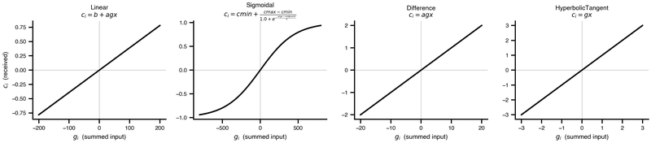

A whole-brain model is dynamics on a network. Three things have to be decided: where the connectome comes from, how regions couple, and whether every region and connection behaves the same way.

The first decision is usually the quickest. TVB-O ships curated connectomes you can reference by IRI, so most experiments never build one. You build your own when the parcellation, the cohort or the tractography method has to match something specific.

## Getting a network

::: {.cards}
| Page | What it covers | Cover |
|---|---|---|
| [Network specification](../Specification/Network.qmd) | The `Network` spec itself: constructors, storage format, and the built-in connectome catalogue. | fa-solid fa-circle-nodes |
| [Build a connectome from tractography](BuildConnectomeFromTractography.qmd) | A tractogram plus a parcellation atlas becomes a schema-compliant network. | fa-solid fa-brain |
:::

## How activity travels

::: {.cards}
| Page | What it covers | Cover |
|---|---|---|
| [Coupling functions](CouplingFunctions.qmd) | The rule that turns one node's state into the signal its neighbours receive. |  |
:::

Coupling is where most first experiments go wrong, in two specific ways: the coupling key must be the model's own input port rather than a name you invent, and a raw connectome carries streamline counts in the hundreds of thousands, which will drive any model to `NaN` unless it is normalized. Both are covered on that page.

## When regions differ

::: {.cards}
| Page | What it covers | Cover |
|---|---|---|
| [Heterogeneous nodes](HeterogeneousNodes.qmd) | Giving regions their own parameters. | fa-solid fa-shapes |
| [Heterogeneous edges](HeterogeneousEdges.qmd) | Giving connections their own behaviour. | fa-solid fa-share-nodes |
| [Hierarchical & surface networks](HierarchicalSurfaceNetworks.qmd) | A fine mesh layered onto a coarse parent network. | fa-solid fa-layer-group |
:::

For a region with genuine internal structure rather than different parameters, see [Beyond the mean field](../BeyondMeanField/index.qmd).

## Reference

[`Network`](../datamodel/classes/Network.qmd) · [`Node`](../datamodel/classes/Node.qmd) · [`Edge`](../datamodel/classes/Edge.qmd).
