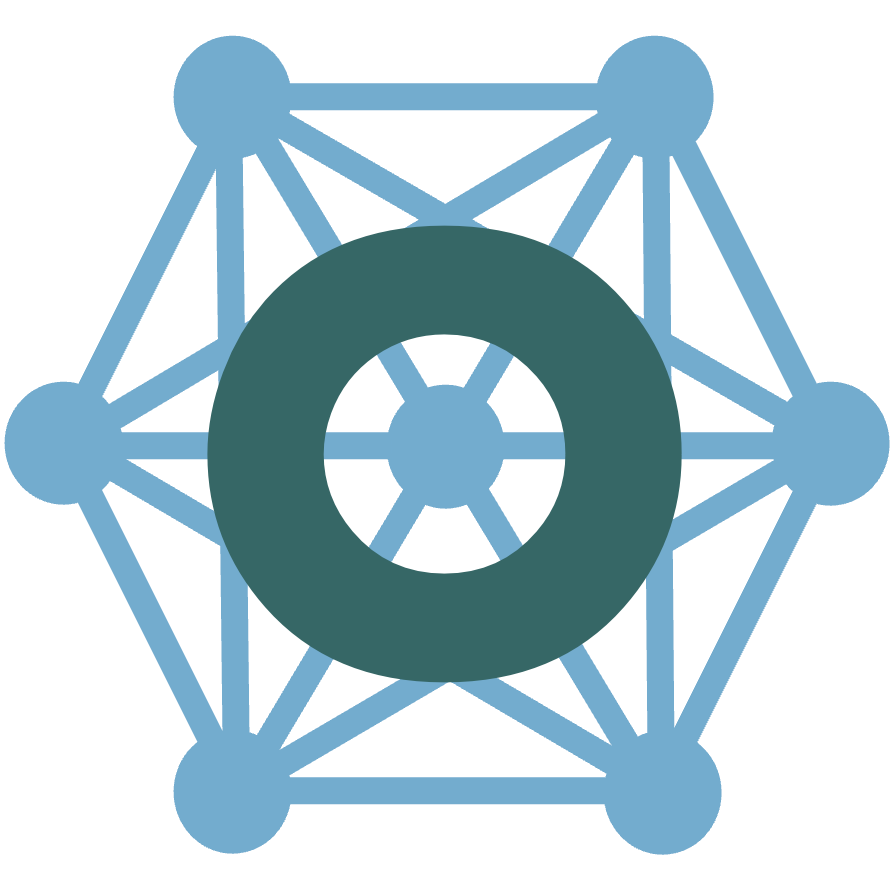

## Welcome to `tvbo`!

:::: {.columns}

::: {.column width='80%'}

`tvbo` is a Python library for defining, simulating, and analyzing dynamical systems in computational neuroscience. It combines ontology-driven knowledge representation with flexible simulation capabilities.

**Core Features:**
- - **Load:** Access curated models and studies from the knowledge database
- **Specify:** Define dynamical systems and network models with simple specification language
- **Build:** Configure brain network models
- **Generate:** Produce optimized simulation code (Python, JAX, Julia)
- **Share:** Export reproducible models with standardized metadata

<button class="button">Get Started</button>
<button class="button button_blue">Live-preview</button>

:::

::: {.column width="20%"}

:::

::::


```{=html}
<div class="button-container">
    <a href="https://tvbo.charite.de" class="card-button">
        <h3><i class="fa-solid fa-brain" aria-hidden="true"></i> TVB-O GUI</h3>
        <p>Open the hosted web app to explore TVB‑O models, datasets, and simulations.</p>
    </a>
    <a href="/browser" class="card-button">
        <h3><i class="fa-solid fa-compass" aria-hidden="true"></i> Model Browser</h3>
        <p>Browse models, parameters, and equations. Inspect relationships and components interactively.</p>
    </a>
    <a href="/datamodel" class="card-button">
        <h3><i class="fa-solid fa-diagram-project" aria-hidden="true"></i> Metadata Schema</h3>
        <p>Explore the TVB‑O metadata schema: classes, fields, and constraints used across resources.</p>
    </a>
</div>
```

---

## Quickstart

:::: {.panel-tabset}
### Python Installation
```bash
pip install tvbo
```
For more installation options, see the [Installation Guide](installation.md).

### Model Specification
```yaml
name: LorenzAttractor
parameters:
    sigma:
        value: 10
        label: Prandtl number
    rho:
        label: Rayleigh number
        value: 28
    beta:
        value: 2.6666666666666665
state_variables:
    X:
        equation:
        lhs: \dot{X}
        rhs: sigma * (Y - X)
    Y:
        equation:
        lhs: \dot{Y}
        rhs: X * (rho - Z) - Y
    Z:
        equation:
        lhs: \dot{Z}
        rhs: X * Y - beta * Z
```
### Generate Code
```{python}
from tvbo import Dynamics, SimulationExperiment
from IPython.display import Markdown
lorenz = Dynamics(
    parameters={
        "sigma": {"value": 10.0},
        "rho": {"value": 28.0},
        "beta": {"value": 8 / 3},
    },
    state_variables={
        "X": {"equation": {"rhs": "sigma * (Y - X)"}},
        "Y": {"equation": {"rhs": "X * (rho - Z) - Y"}},
        "Z": {"equation": {"rhs": "X * Y - beta * Z"}},
    },
)

code = SimulationExperiment(dynamics=lorenz).render_code('jax')
```

**output**:
```{python}
Markdown("```python" + code + "```")
```

### Run Dynamics

```{python}
from tvbo import Dynamics, SimulationExperiment

lorenz = Dynamics(
    parameters={
        "sigma": {"value": 10.0},
        "rho": {"value": 28.0},
        "beta": {"value": 8 / 3},
    },
    state_variables={
        "X": {"equation": {"rhs": "sigma * (Y - X)"}},
        "Y": {"equation": {"rhs": "X * (rho - Z) - Y"}},
        "Z": {"equation": {"rhs": "X * Y - beta * Z"}},
    },
)

SimulationExperiment(dynamics=lorenz).run(duration=1000).integration.plot()
```

### Explore network dynamics with `tvboptim`
```{python}
import matplotlib.pyplot as plt
from tvbo import Network
from tvbo import SimulationExperiment, Dynamics
from tvbo import Coupling
from tvboptim.types import GridAxis, Space
from tvboptim.execution import ParallelExecution
import jax
import bsplot

c = Coupling.from_ontology("Linear")
c.parameters["a"].value = 1.0

sc = Network(
    parcellation={"atlas": {"name": "DesikanKilliany"}},
    normalization={"rhs": "(W - W_min) / (W_max - W_min)"},
    coupling=c,
)

exp = SimulationExperiment(
    dynamics=Dynamics.from_ontology("Generic2dOscillator"),
    network=sc,
    integration={
        "method": "Heun",
        "duration": 3000,
        "step_size": 0.1,
    },
)

model = exp.execute("jax")

state = exp.collect_state()

n = 8
# Explore a (controls Hopf bifurcation) and d (time scale separation)
# a ~ 0 is the bifurcation point; d controls fast/slow dynamics
state.parameters.dynamics.a = GridAxis(-2, 1.5, n)
state.parameters.dynamics.d = GridAxis(0.01, 0.1, n)
grid = Space(state, mode="product")

n_devices = jax.device_count()


def explore():
    exec = ParallelExecution(model, grid, n_pmap=n_devices, n_vmap=10)
    return exec.run()


exploration_results = explore()

print(exploration_results.results.shape)

# Reshape: (n_pmap, n_vmap, time, state_vars, nodes, modes) -> (n_combinations, time, state_vars, nodes)
data = exploration_results.results.data.squeeze()  # remove modes dim
# Flatten n_pmap and n_vmap dimensions
data = data.reshape(-1, *data.shape[2:])  # (n_pmap*n_vmap, time, state_vars, nodes)

# Get parameter values directly from the grid (no redundant linspace!)
axis_vals = grid._generate_axis_values()
a_vals = axis_vals.parameters.dynamics.a
d_vals = axis_vals.parameters.dynamics.d

fig, axs = plt.subplots(n, n, figsize=(12, 12))
for i in range(min(n * n, data.shape[0])):
    row, col = i // n, i % n
    ax = axs[row, col]
    # data[i] has shape (time, state_vars, nodes) - plot first state variable, first node
    ax.plot(data[i, 1000:, 0, 0], linewidth=0.5)

    # Labels: rows = a (first axis), cols = d (second axis)
    if row == 0:
        ax.set_title(f"d={d_vals[col]:.3f}", fontsize=10)
    if col == 0:
        ax.set_ylabel(f"a={a_vals[row]:.2f}", fontsize=10)

bsplot.style.format_fig(fig)

for ax in fig.axes:
    ax.set_xticks([])
    ax.set_yticks([])
```

::::
