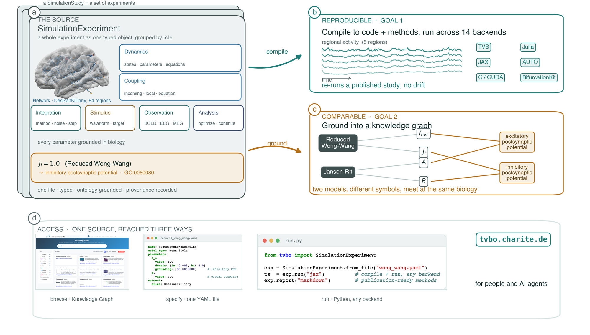

::: {.tvbo-home}

```{=html}
<section class="hero">
  <div class="hero__intro">
    <div class="hero__head">
      <p class="eyebrow">The Virtual Brain Ontology</p>
      <h1 class="hero__title">One specification for a whole <em>brain-network</em> simulation.</h1>
      <p class="hero__lede">
        From one typed, ontology-grounded spec, <code>tvbo</code> compiles runnable code
        across many backends and a methods report — and grounds every parameter in a
        knowledge graph. Studies re-run without drift; models compare even when they
        share no notation.
      </p>
    </div>

    <div class="hero__art" aria-hidden="true">
    <svg class="connectome" viewBox="0 0 400 400" role="img">
      <g class="edges">
        <line class="edge" x1="200" y1="50"    x2="329.9" y2="125"   style="animation-delay:.05s"/>
        <line class="edge" x1="329.9" y1="125" x2="329.9" y2="275"   style="animation-delay:.11s"/>
        <line class="edge" x1="329.9" y1="275" x2="200" y2="350"     style="animation-delay:.17s"/>
        <line class="edge" x1="200" y1="350"   x2="70.1" y2="275"    style="animation-delay:.23s"/>
        <line class="edge" x1="70.1" y1="275"  x2="70.1" y2="125"    style="animation-delay:.29s"/>
        <line class="edge" x1="70.1" y1="125"  x2="200" y2="50"      style="animation-delay:.35s"/>
        <line class="edge edge--diag" x1="200" y1="50"    x2="329.9" y2="275" style="animation-delay:.30s"/>
        <line class="edge edge--diag" x1="329.9" y1="125" x2="200" y2="350"   style="animation-delay:.36s"/>
        <line class="edge edge--diag" x1="329.9" y1="275" x2="70.1" y2="275"  style="animation-delay:.42s"/>
        <line class="edge edge--diag" x1="200" y1="350"   x2="70.1" y2="125"  style="animation-delay:.48s"/>
        <line class="edge edge--diag" x1="70.1" y1="275"  x2="200" y2="50"    style="animation-delay:.54s"/>
        <line class="edge edge--diag" x1="70.1" y1="125"  x2="329.9" y2="125" style="animation-delay:.60s"/>
        <line class="edge" x1="200" y1="200" x2="200" y2="50"    style="animation-delay:.55s"/>
        <line class="edge" x1="200" y1="200" x2="329.9" y2="125" style="animation-delay:.60s"/>
        <line class="edge" x1="200" y1="200" x2="329.9" y2="275" style="animation-delay:.65s"/>
        <line class="edge" x1="200" y1="200" x2="200" y2="350"   style="animation-delay:.70s"/>
        <line class="edge" x1="200" y1="200" x2="70.1" y2="275"  style="animation-delay:.75s"/>
        <line class="edge" x1="200" y1="200" x2="70.1" y2="125"  style="animation-delay:.80s"/>
      </g>
      <g class="pulses">
        <circle class="pulse" r="4.5" style="offset-path:path('M70.1,125 L329.9,125'); animation-delay:0s"/>
        <circle class="pulse" r="4.5" style="offset-path:path('M329.9,275 L70.1,275'); animation-delay:.9s"/>
        <circle class="pulse" r="4.5" style="offset-path:path('M200,200 L329.9,275'); animation-delay:1.7s"/>
        <circle class="pulse" r="4.5" style="offset-path:path('M200,50 L70.1,275'); animation-delay:2.5s"/>
      </g>
      <g class="nodes">
        <circle class="node node--outer" cx="200" cy="50"    r="9"  style="animation-delay:.90s"/>
        <circle class="node node--outer" cx="329.9" cy="125" r="9"  style="animation-delay:.95s"/>
        <circle class="node node--outer" cx="329.9" cy="275" r="9"  style="animation-delay:1.00s"/>
        <circle class="node node--outer" cx="200" cy="350"   r="9"  style="animation-delay:1.05s"/>
        <circle class="node node--outer" cx="70.1" cy="275"  r="9"  style="animation-delay:1.10s"/>
        <circle class="node node--outer" cx="70.1" cy="125"  r="9"  style="animation-delay:1.15s"/>
        <circle class="node node--center" cx="200" cy="200"  r="44" style="animation-delay:1.25s"/>
        <circle class="node node--hub"    cx="200" cy="200"  r="9"  style="animation-delay:1.32s"/>
      </g>
    </svg>
    </div>
  </div>

  <div class="hero__bar">
    <div class="hero__cta">
      <a class="btn btn--primary" href="GettingStarted.html">Get started <span aria-hidden="true">&rarr;</span></a>
      <a class="btn btn--ghost" href="platform.html">Explore the platform <span aria-hidden="true">&rarr;</span></a>
    </div>
  </div>
</section>

<section class="pipeline">
  <p class="section-eyebrow">The five steps this documentation follows</p>
  <ol class="steps">
    <li class="step" style="--phase:var(--phase-1)"><span class="step__n">1</span><h3>Explore</h3><p>Find curated models, networks and published studies in the knowledge base.</p></li>
    <li class="step" style="--phase:var(--phase-2)"><span class="step__n">2</span><h3>Specify</h3><p>Declare the experiment — dynamics, network, observations, figures.</p></li>
    <li class="step" style="--phase:var(--phase-3)"><span class="step__n">3</span><h3>Generate</h3><p>Compile it to backend-native code, plots and a study directory.</p></li>
    <li class="step" style="--phase:var(--phase-4)"><span class="step__n">4</span><h3>Run</h3><p>Execute on a laptop or a cluster, and read the result back.</p></li>
    <li class="step" style="--phase:var(--phase-5)"><span class="step__n">5</span><h3>Share</h3><p>Publish to the platform, and export results as BIDS.</p></li>
  </ol>
  <div class="pipeline__targets">
    <span class="step__n step__n--sm" aria-hidden="true">3</span>
    <span class="chips__label">From one source</span>
    <span class="targets__arrow" aria-hidden="true">&rarr;</span>
    <ul class="chips">
      <li>TVB</li><li>JAX</li><li>Julia</li><li>C / CUDA</li><li>Brian2</li><li>PyRates</li><li>NeuroML</li>
    </ul>
  </div>
  <p class="pipeline__note">Every page carries the number of the step it belongs to, in the top-left corner.</p>
</section>

<figure class="overview">
  
  <figcaption>One specification, two payoffs — TVB-O compiles code and a methods report across backends (reproducible) and grounds every entity in a knowledge graph (comparable).</figcaption>
</figure>

<div class="cards">
  <a class="card" href="api/index.html">
    <span class="card__icon"><i class="fa-brands fa-python" aria-hidden="true"></i></span>
    <h3>Python Software</h3>
    <p>The <code>tvbo</code> library — specify models, generate code across backends, and run simulations from Python.</p>
    <span class="card__more">API reference &rarr;</span>
  </a>
  <a class="card" href="https://tvbo.charite.de">
    <span class="card__icon"><i class="fa-solid fa-globe" aria-hidden="true"></i></span>
    <h3>Platform</h3>
    <p>The hosted web app — browse models &amp; networks, build experiments, and export, with no install.</p>
    <span class="card__more">Open the app &#8599;</span>
  </a>
  <a class="card" href="datamodel/index.html">
    <span class="card__icon"><i class="fa-solid fa-diagram-project" aria-hidden="true"></i></span>
    <h3>Data Model</h3>
    <p>The typed metadata schema behind every spec — classes, fields, and constraints.</p>
    <span class="card__more">Explore the schema &rarr;</span>
  </a>
</div>
```

:::

---

## A first simulation

Install it, then run a whole-brain model in one call. The specification is data — the same text runs on any backend TVB-O supports.

```{python}
#| label: first-run
from tvbo import SimulationExperiment

SPEC = """
label: "A whole-brain simulation"
dynamics:
  iri: tvbo:Generic2dOscillator
network:
  iri: tvbo:DesikanKilliany
  transforms:
    - name: weight
      equation: {rhs: "weight / mean(weight[weight > 0])"}
  coupling:
    c_glob: {iri: tvbo:Linear, delayed: false, incoming_states: [V]}
integration: {method: Heun, step_size: 0.1, duration: 600.0, transient_time: 200.0}
"""

result = SimulationExperiment.from_string(SPEC).run()
V = result.integration.data.sel(variable="V")
print(f"{V.sizes['node']} regions x {V.sizes['time']} timepoints")
```

```{python}
#| label: fig-home
#| fig-cap: "Eighty-seven cortical and subcortical regions, coupled through a structural connectome."
#| code-fold: true
result.integration.plot(type="raster")
```

## The same experiment, three ways

TVB-O keeps one specification and three ways to hold it. These are alternatives, not steps — pick whichever suits the task.

:::: {.panel-tabset}

### YAML

```yaml
label: "A whole-brain simulation"
dynamics:
  iri: tvbo:Generic2dOscillator
network:
  iri: tvbo:DesikanKilliany
  coupling:
    c_glob: {iri: tvbo:Linear, delayed: false, incoming_states: [V]}
integration: {method: Heun, step_size: 0.1, duration: 600.0}
```

### Python

```python
from tvbo import SimulationExperiment

exp = SimulationExperiment(
    label="A whole-brain simulation",
    dynamics={"iri": "tvbo:Generic2dOscillator"},
    network={
        "iri": "tvbo:DesikanKilliany",
        "coupling": {"c_glob": {"iri": "tvbo:Linear", "delayed": False, "incoming_states": ["V"]}},
    },
    integration={"method": "Heun", "step_size": 0.1, "duration": 600.0},
)
result = exp.run()
```

### CLI

```bash
tvbo run experiment.yaml -b jax -o ./out
tvbo export jax experiment.yaml -o solve.py
```

::::

## Where to start

| | |
|---|---|
| **New to TVB-O** | [Getting started](GettingStarted.qmd) walks one equation to a whole brain. |
| **Want the spec** | [The SimulationExperiment object](Simulation/SimulationExperiments.qmd). |
| **Replicating a paper** | [Linked experiments in a SimulationStudy](Simulation/SimulationStudies.qmd). |
| **Coming from another tool** | [Interoperability](Interoperability/index.qmd) maps TVB, PyRates, NeuroML and the Julia backends. |
