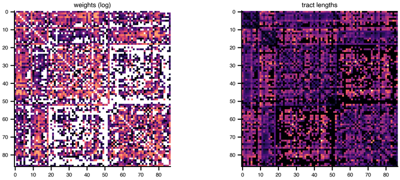

Running is the part that should be boring. `exp.run()` picks a backend, executes the generated code, and hands back a result container whose axes are *named* — `time`, `node`, `variable`, and one axis per swept parameter — so a selection is written by label and cannot silently land on the wrong region. The same container is what figures bind to and what a report reads its numbers from.

Where it runs is a deployment detail, not a modelling one. A single subject on a laptop and a cohort on a GPU partition execute the same emitted code.

::: {.cards}
| Page | What it covers | Cover |
|---|---|---|
| [Run on a backend](../Simulation/Backends.qmd) | Choosing a backend, what each one is good at, and how to pin one. | fa-solid fa-microchip |
| [The experiment result](../Simulation/Results.qmd) | The result container: its axes, its coordinates, and how to select from it. | fa-solid fa-database |
| [Visualization](../Simulation/Visualization.qmd) | Quick looks at a run — raster, timeseries, phase plane, network. |  |
| [HPC patterns & containers](../CLI/hpc.qmd) | Taking the same study to a cluster without hand-writing a job script. | fa-solid fa-server |
:::

## Next

A finished run is worth publishing: [⑤ Share](share.qmd).
