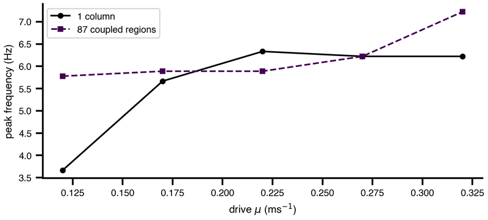
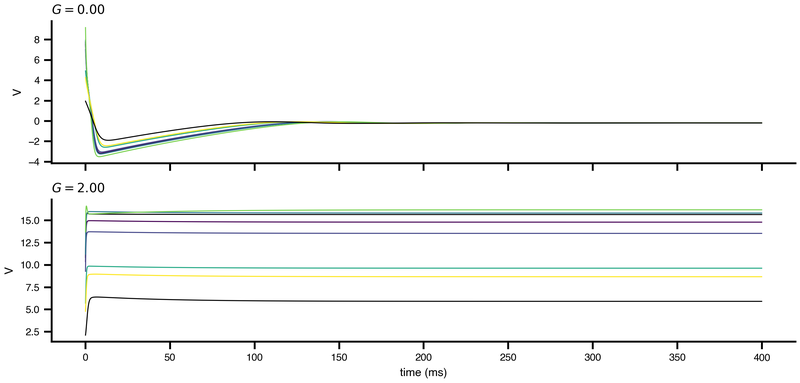

A TVB-O experiment is a document, not a script. You declare what the system *is* — its dynamics, the network it runs on, how nodes couple, what is observed, what is fitted, what is plotted — and nothing about how to integrate it or which library to call. That separation is the whole point: the same document runs on JAX, TVB, Julia, C or Brian2, and it stays readable years after the run.

This is the longest step, because it is where all the modelling decisions live. Nothing else in the spine asks you to make a choice.

## The object itself

::: {.cards}
| Page | What it covers | Cover |
|---|---|---|
| [The running example](../Specification/RunningExample.qmd) | One experiment, grown field by field across the whole guide. |  |
| [The SimulationExperiment](../Simulation/SimulationExperiments.qmd) | Every top-level field, and which ones are required. | fa-solid fa-file-lines |
| [Writing TVB-O YAML](../Specification/YAML.qmd) | The YAML dialect: IRIs, includes, anchors and the `tvbo_class` envelope. | fa-solid fa-code |
:::

## What the nodes do

::: {.cards}
| Page | What it covers | Cover |
|---|---|---|
| [Dynamical systems](../Models/index.qmd) | Reuse a curated model, or write your own equations. | fa-solid fa-wave-square |
| [Events & stimulation](../Models/Events.qmd) | Drive the system with a stimulus that is itself part of the spec. |  |
| [Solving a network of DDEs](../Models/Integrators.qmd) | Integrators, step size, and what delays cost. | fa-solid fa-timeline |
:::

## What connects them

::: {.cards}
| Page | What it covers | Cover |
|---|---|---|
| [Networks & connectomes](../Networks/index.qmd) | Where the connectome comes from, how regions couple, and how they differ. | fa-solid fa-circle-nodes |
:::

## What comes out

::: {.cards}
| Page | What it covers | Cover |
|---|---|---|
| [Observation models](../Simulation/ObservationModels.qmd) | BOLD, EEG, MEG — the forward model that turns states into a signal. | fa-solid fa-brain |
| [Analyses](../Specification/Analyses.qmd) | Declared post-processing that travels with the study. | fa-solid fa-chart-line |
| [Specify a figure](../Simulation/Figures.qmd) | A figure as data: a mosaic of panels bound to result fields. | fa-solid fa-images |
:::

## Beyond one run

::: {.cards}
| Page | What it covers | Cover |
|---|---|---|
| [Parameter exploration](../Simulation/ParameterExploration.qmd) | Sweep an axis instead of running one point. |  |
| [Fitting, inference & optimization](../Fitting/index.qmd) | Fit parameters to data, with the loss declared alongside them. | fa-solid fa-bullseye |
| [Linked experiments in a SimulationStudy](../Simulation/SimulationStudies.qmd) | Many experiments, one study, shared figures. | fa-solid fa-diagram-project |
| [Fan-out over subjects and phenotypes](../Specification/FanOut.qmd) | One recipe across a cohort. | fa-solid fa-users |
| [Calling your own code](../Specification/CodeSource.qmd) | The escape hatch, when the grammar cannot say it. | fa-solid fa-terminal |
:::

## Next

A finished spec is compiled, not interpreted: [③ Generate](generate.qmd).
