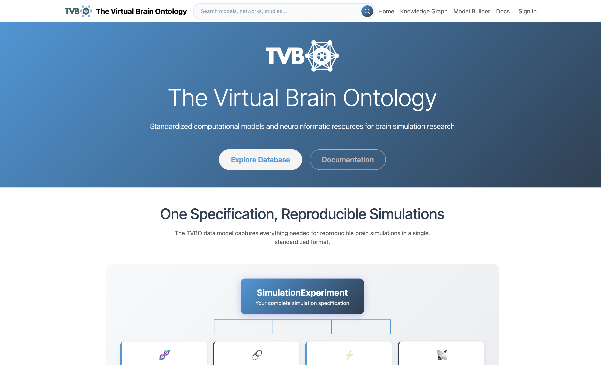

The **TVB-O Platform** is a web application hosted at [tvbo.charite.de](https://tvbo.charite.de/) that provides browser-based access to the TVB-O knowledge base, model database, and simulation configurator — no local installation required.



## What the Platform Offers

| Feature | Description |
|---------|-------------|
| **Knowledge Graph** | Browse and search neural mass models, coupling functions, integrators, and studies |
| **Model Builder** | Configure and export simulation experiments via a graphical interface |
| **Database** | Curated YAML definitions for models, networks, and complete experiments |
| **Documentation** | Integrated links to this documentation |

## Accessing the Platform

The platform is publicly available at:

👉 **[https://tvbo.charite.de/](https://tvbo.charite.de/)**

## Platform Architecture

The platform runs on [Odoo 17](https://www.odoo.com/) with a custom TVBO module and a FastAPI backend that exposes the Python `tvbo` library. The source code is available at [github.com/TVB-Ontology/tvbo-platform](https://github.com/TVB-Ontology/tvbo-platform).

## Using the Python Library

For programmatic access and full simulation capabilities, install the `tvbo` Python package locally:

```bash
pip install tvbo
```

See the [Installation](installation.md) and [Usage](GettingStarted.qmd) guides to get started.
