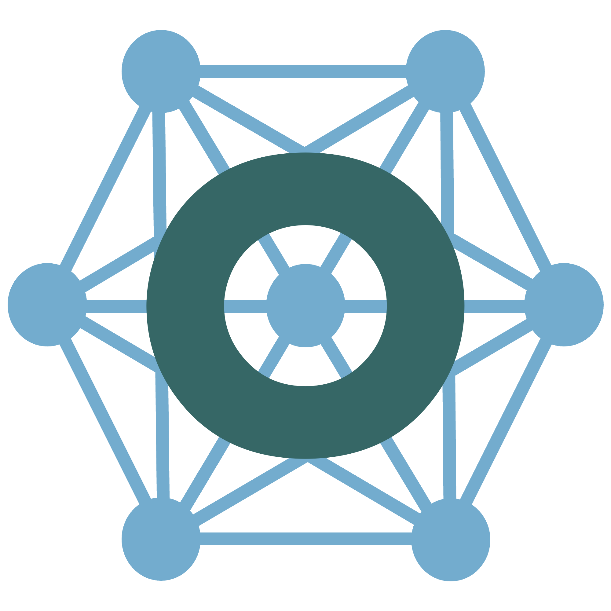

# The Virtual Brain Ontology (TVB-O)
Welcome to the TVB Ontology (TVB-O) repository. This repository contains the TVB-O in OWL format, as well as future scripts to transform to and from the TVB data model.

## Contributing to TVB-O
If you would like to contribute to the TVB-O, please follow the steps below:
1. Fork the repository
2. Clone the repository to your local machine
3. Make your changes
4. Push your changes to your fork
5. Create a pull request
6. Wait for the pull request to be reviewed
7. Make any necessary changes
8. Once the pull request is approved, it will be merged into the main branch

For more information on contributing: [a step-by-step guide of contributing to ontologies](https://oboacademy.github.io/obook/lesson/contributing-to-obo-ontologies/).
